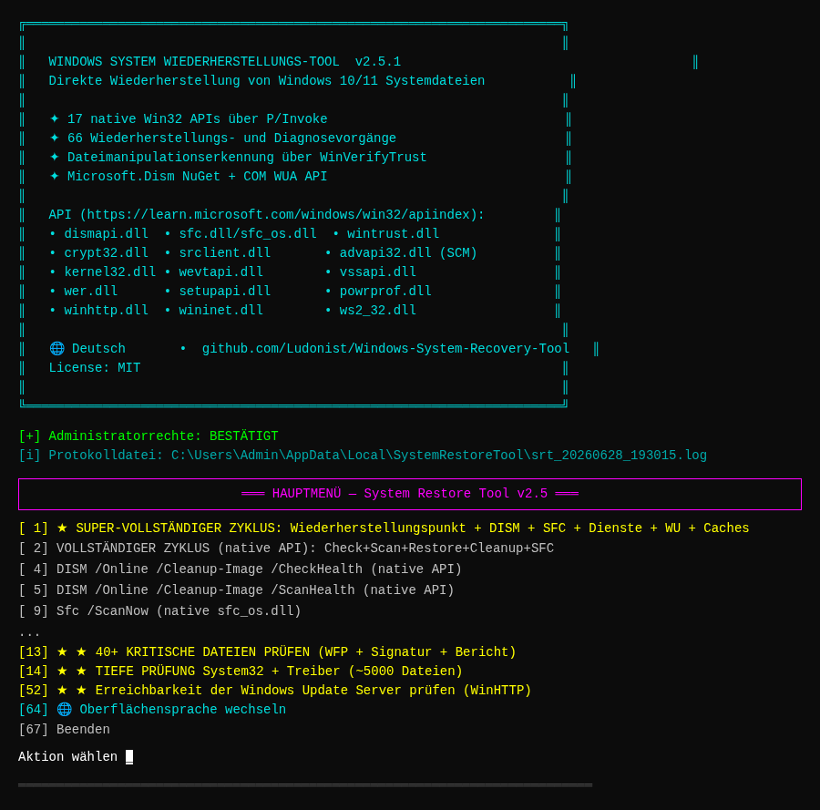
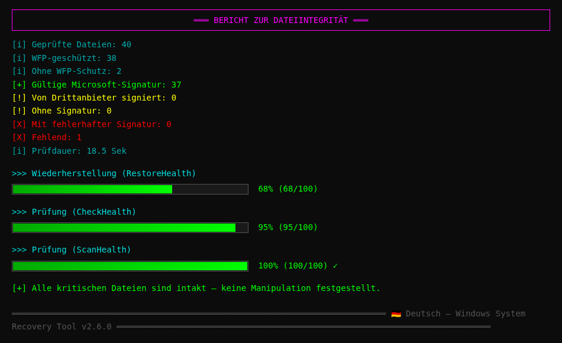
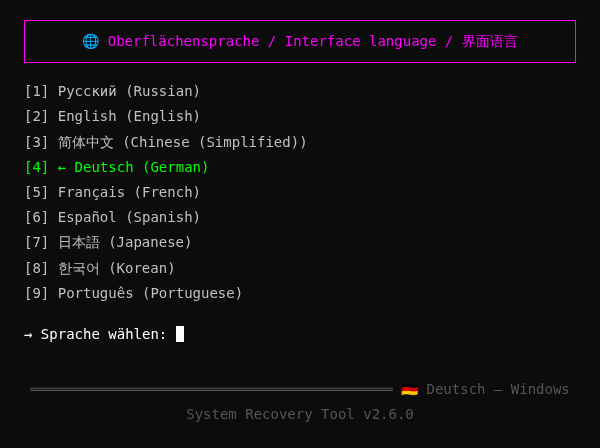
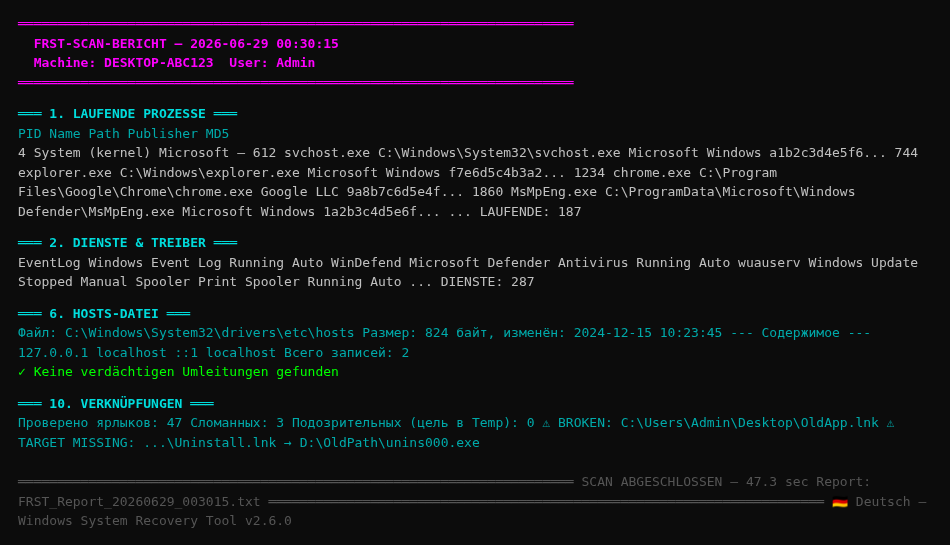
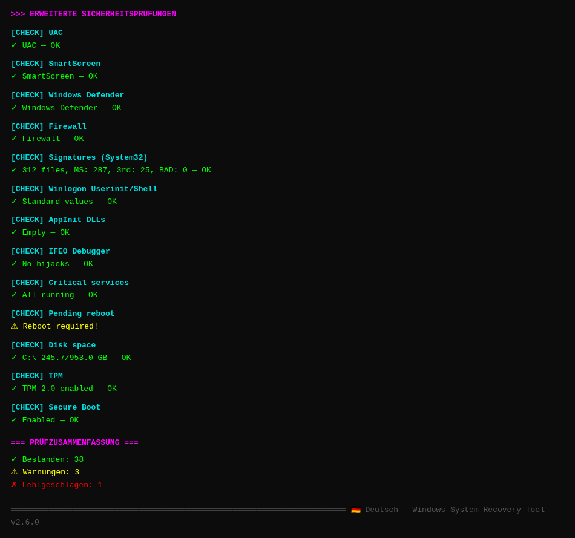
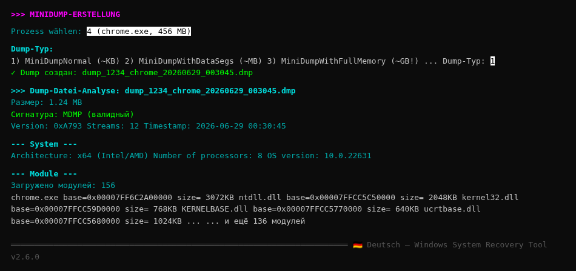

# 🔧 Windows System Wiederherstellungs-Tool

<div align="center">

🌐 **Verfügbare Sprachen / Available languages / 可用语言 / Unterstützte Sprachen / Langues disponibles / Idiomas disponibles / 利用可能な言語 / 사용 가능한 언어 / Idiomas disponíveis:**

[🇷🇺 Русский](README.md) · [🇬🇧 English](README.en.md) · [🇨🇳 简体中文](README.zh.md) · [🇩🇪 Deutsch](README.de.md) · [🇫🇷 Français](README.fr.md) · [🇪🇸 Español](README.es.md) · [🇯🇵 日本語](README.ja.md) · [🇰🇷 한국어](README.ko.md) · [🇵🇹 Português](README.pt.md)

🌐 **Dokumentation mit automatischer Spracherkennung**: https://ludonist.github.io/Windows-System-Recovery-Tool/

---


**Professionelles Tool zur Wiederherstellung von Windows 10/11-Systemdateien über direkte Win32-API-Aufrufe**

🌐 **Mehrsprachige Benutzeroberfläche**: Русский · English · 简体中文 · Deutsch · Français · Español · 日本語 · 한국어 · Português

[Funktionen](#-features) ·
[Screenshots](#-screenshots) ·
[Installation](#-installation) ·
[Verwendung](#-usage) ·
[Architektur](#-architecture) ·
[API](#-win32-apis-used) ·
[Build](#-building-from-source) ·
[Mitwirken](#-contributing)

</div>

---

## 📖 Über das Projekt

**Windows System Wiederherstellungs-Tool** ist eine Konsolenanwendung für Windows 10/11, die Systemdateien wiederherstellt und deren Integrität überprüft — und zwar über **direkte Windows-API-Aufrufe** (`dismapi.dll`, `sfc.dll`, `wintrust.dll` usw.) — nicht über externe Befehle wie `cmd.exe` / `dism.exe` / `sfc.exe`.

### Wichtigste Funktionen

- 🎯 **67 Operationen** zur Wiederherstellung und Diagnose in einem Menü
- 🔌 **17 native Windows-APIs** über P/Invoke (keine Shell-Befehle)
- 🛡️ **Manipulationserkennung für Dateien**: WinVerifyTrust + Zertifikat-Herausgeber
- 📊 **SHA256/SHA1-Snapshots** zum Vergleich des Systemzustands über die Zeit
- 🧩 **Microsoft.Dism NuGet** als alternative verwaltete Implementierung
- 📋 **Detaillierte Protokollierung** in `%LOCALAPPDATA%\SystemRestoreTool\`
- ⚡ **Eigenständiger Build** — keine .NET-Installation erforderlich
- 🌐 **Mehrsprachige Benutzeroberfläche**: Русский / English / 简体中文 / Deutsch / Français / Español / 日本語 / 한국어 / Português

### Probleme, die dieses Tool löst

| Symptom | Lösung |
|---------|----------|
| `sfc /scannow` findet Beschädigungen | DISM RestoreHealth + SFC /ScanNow |
| Verdacht auf virale DLL-Manipulation | WinVerifyTrust für alle kritischen Dateien |
| Windows Update defekt | SoftwareDistribution zurücksetzen + DLLs neu registrieren |
| Dienste starten nicht | 40+ kritische Dienste über SCM neu starten |
| Bootloader-Ausfall | BCD-Prüfung und -Wiederherstellung |
| Kein Wiederherstellungspunkt | Erstellung über `SRSetRestorePoint` |
| Symbol-/Schriftartcache beschädigt | IconCache.db / FNTCACHE.DAT neu aufbauen |
| Bedenken zur Systemintegrität | SHA256-Snapshot + Vergleich mit Basislinie |

---

## ✨ Funktionen

### 1. Wiederherstellung über die DISM-API (`dismapi.dll`)

| Operation | Konsolen-Äquivalent |
|----------|---------------------|
| CheckHealth | `Dism /Online /Cleanup-Image /CheckHealth` |
| ScanHealth | `Dism /Online /Cleanup-Image /ScanHealth` |
| RestoreHealth | `Dism /Online /Cleanup-Image /RestoreHealth` |
| StartComponentCleanup | `Dism /Online /Cleanup-Image /StartComponentCleanup` |
| StartComponentCleanup + ResetBase | `... /StartComponentCleanup /ResetBase` |

### 2. SFC über native `sfc_os.dll`

| Operation | Äquivalent |
|----------|------------|
| SfcSynchronousScan (ScanAndRepair) | `Sfc /ScanNow` |
| SfcSynchronousScan (VerifyOnly) | `Sfc /VerifyOnly` |
| SfcIsFileProtected | (kein Äquivalent) |
| SfcGetNextProtectedFile | (kein Äquivalent) |

### 3. Integritätsprüfung

- **40+ kritische Dateien** — kernel32.dll, ntdll.dll, winlogon.exe, lsass.exe, csrss.exe, smss.exe, Treiber (tcpip.sys, ntfs.sys, volmgr.sys, ACPI.sys, hal.dll, ...) und weitere
- **Tiefenprüfung System32 + Treiber** — alle .dll/.exe/.sys (~5000 Dateien)
- **Vollständige Prüfung System32 + SysWOW64** — ~10000 Dateien
- Für jede Datei: WFP-Schutz, Authenticode-Signatur, Herausgeber (Microsoft vs. Drittanbieter)

### 4. Wiederherstellungsmodule (14 Module)

| Modul | Zweck | API |
|--------|---------|-----|
| `SystemRestorePointManager` | Wiederherstellungspunkte | `srclient.dll!SRSetRestorePoint` |
| `ServicesRepairManager` | 40+ Dienste neu starten | `advapi32.dll` SCM |
| `BootRecoveryManager` | BCD, bootmgr, winload | WMI + bcdedit |
| `RegistryRestoreManager` | Registrierungs-Hive-Backup | `advapi32.dll!RegSaveKey` |
| `WindowsUpdateRepairManager` | WU zurücksetzen | SCM + File API |
| `WinSxsRepairManager` | WinSxS-Bereinigung | `dismapi.dll!DismAnalyzeComponentStore` |
| `EventLogManager` | Ereignisprotokolle | `wevtapi.dll!EvtClearLog` |
| `UserEnvRestoreManager` | Profile, Caches | advapi32 + File API |
| `FileHashDatabaseManager` | SHA256-Snapshots | `System.Security.Cryptography` |
| `DeviceManager` | Geräte | `setupapi.dll` |
| `PowerOptionsManager` | Energieschemata | `powrprof.dll` |
| `NetworkDiagnosticManager` | Netzwerk | `winhttp.dll` + `ws2_32.dll` |
| `WerManager` | WER-Berichte | `wer.dll` |
| `WindowsUpdateAgentManager` | Updatesuche | COM WUA API |

---

## 📸 Screenshots

### Hauptmenü



### Systemdatei-Integritätsprüfung (mit Fortschrittsbalken)



### Oberflächensprache wechseln



### FRST-Vollsystem-Scan



### Erweiterte Sicherheitsprüfungen (40+)



### MiniDump-Manager — Prozessanalyse



---

## 📥 Installation

### Option 1: Vorkompilierte EXE herunterladen (empfohlen)

**Direkte Download-Links** (frischer Build, keine Abhängigkeiten):

| Architektur | Eigenständig (enthält .NET) | Kompakt (.NET 6 erforderlich) |
|--------------|----------------------------:|--------------------------:|
| **x64** (Intel/AMD) | [standalone-win-x64.zip](https://github.com/Ludonist/Windows-System-Recovery-Tool/releases/download/v2.5.1/SystemRestoreTool-standalone-win-x64.zip) (~40 MB) | [compact-win-x64.zip](https://github.com/Ludonist/Windows-System-Recovery-Tool/releases/download/v2.5.1/SystemRestoreTool-standalone-win-x64-compact.zip) (~7 MB) |
| **x86** (32-bit) | [standalone-win-x86.zip](https://github.com/Ludonist/Windows-System-Recovery-Tool/releases/download/v2.5.1/SystemRestoreTool-standalone-win-x86.zip) (~37 MB) | [compact-win-x86.zip](https://github.com/Ludonist/Windows-System-Recovery-Tool/releases/download/v2.5.1/SystemRestoreTool-standalone-win-x86-compact.zip) (~7 MB) |
| **ARM64** (Surface/Qualcomm) | [standalone-win-arm64.zip](https://github.com/Ludonist/Windows-System-Recovery-Tool/releases/download/v2.5.1/SystemRestoreTool-standalone-win-arm64.zip) (~33 MB) | [compact-win-arm64.zip](https://github.com/Ludonist/Windows-System-Recovery-Tool/releases/download/v2.5.1/SystemRestoreTool-standalone-win-arm64-compact.zip) (~6 MB) |

**Eigenständige Version** (empfohlen) — enthält .NET 6 Runtime, benötigt sonst nichts.

**Kompakte Version** — erfordert [.NET Desktop Runtime 6.0+](https://dotnet.microsoft.com/download/dotnet/6.0).

### Option 2: GitHub Releases

Alle Binärdateien sind ebenfalls auf der Seite [Releases v2.5.1](https://github.com/Ludonist/Windows-System-Recovery-Tool/releases/tag/v2.5.1) verfügbar, zusammen mit SHA256-Prüfsummen zur Integritätsverifikation.

### Option 3: Aus dem Quellcode bauen

Siehe [Aus dem Quellcode bauen](#-building-from-source).

### Anforderungen

- **Betriebssystem**: Windows 10 (Build 19041+, May 2020 Update) oder Windows 11
- **Architektur**: x64 / x86 / ARM64
- **Berechtigungen**: Administrator (im Manifest bereits festgelegt)
- **Für kompakten Build**: .NET Desktop Runtime 6.0+

### Integrität prüfen

Nach dem Download SHA256 prüfen:
```cmd
certutil -hashfile SystemRestoreTool-standalone-win-x64.zip SHA256
```
Vergleichen Sie mit den `.sha256`-Dateien neben jedem Archiv auf der Seite [Releases v2.5.1](https://github.com/Ludonist/Windows-System-Recovery-Tool/releases/tag/v2.5.1).

---

## 🚀 Verwendung

### Interaktiver Modus

`SystemRestoreTool.exe` als Administrator ausführen. Es öffnet sich ein Menü mit 67 Einträgen:

```
╔══════════════════════════════════════════════════════════════════════╗
║                                                                      ║
║   WINDOWS SYSTEM RECOVERY TOOL  v2.5.1                               ║
║   Direct recovery of Windows 10/11 system files                      ║
║   ...                                                                ║
╚══════════════════════════════════════════════════════════════════════╝
[+] Administrator privileges: CONFIRMED
[i] Log file: C:\Users\...\AppData\Local\SystemRestoreTool\srt_20260628_193015.log

MAIN MENU — System Restore Tool v2.5

  [ 1] ★ SUPER-FULL CYCLE: restore point + DISM + SFC + services + WU + caches
  [ 2]   FULL CYCLE (native API)
  [ 3]   FULL CYCLE (Microsoft.Dism NuGet)
  ...
  [67]   Exit

Select action: _
```

### Automatische Modi (für Skripte)

```cmd
:: Super-full cycle: restore point + DISM + SFC + services + WU + caches
SystemRestoreTool.exe --super-full

:: Same + ResetBase WinSxS
SystemRestoreTool.exe --super-full --reset-base

:: Full DISM + SFC cycle
SystemRestoreTool.exe --full

:: Check 40+ critical files
SystemRestoreTool.exe --verify

:: Deep check System32 + drivers
SystemRestoreTool.exe --scan-all
```

### Protokollierung

Alle Operationen werden gleichzeitig in die Konsole (mit Farbe) und in eine Datei geschrieben:
```
%LOCALAPPDATA%\SystemRestoreTool\srt_YYYYMMDD_HHMMSS.log
```

### 🌐 Mehrsprachige Benutzeroberfläche

Das Programm unterstützt **3 Oberflächensprachen**:

| Code | Nativer Name | Englischer Name |
|------|-------------|--------------|
| `ru` | Русский | Russian |
| `en` | English | English |
| `zh` | 简体中文 | Chinese (Simplified) |

**Sprache wechseln:**
1. Im Hauptmenü den Eintrag **64** ("🌐 Switch interface language") wählen
2. Gewünschte Sprache auswählen (1-3)
3. Die Auswahl wird **in der Registrierung gespeichert** (`HKCU\SOFTWARE\SystemRestoreTool\Language`) und beim nächsten Start angewendet

Übersetzungsdateien: `Resources/strings.{ru,en,zh}.json`. Sie sind als eingebettete Ressourcen in die EXE integriert, sodass nichts weiter kopiert werden muss.

**Neue Sprache hinzufügen:**
1. `Resources/strings.en.json` nach `Resources/strings.xx.json` kopieren (`xx` = Sprachcode)
2. Alle Werte übersetzen
3. Code zu `Localizer.SupportedLanguages` und `LanguageNames` hinzufügen
4. Eintrag in `.csproj` als `<EmbeddedResource>` hinzufügen

---

## 🏗 Architektur

```
Windows-System-Recovery-Tool/
├── SystemRestoreTool.csproj      .NET 6.0, x64/x86/ARM64, Microsoft.Dism NuGet
├── app.manifest                  requireAdministrator
├── Program.cs                    Einstiegspunkt, 67-Einträge-Menü
│
├── Api/                          P/Invoke-Ebene (native Windows-DLLs)
│   ├── DismNativeApi.cs          dismapi.dll (DISM API)
│   ├── SfcNativeApi.cs           sfc.dll + sfc_os.dll + srclient.dll
│   ├── WinTrustNativeApi.cs      wintrust.dll + crypt32.dll (Signaturen)
│   ├── Kernel32NativeApi.cs      kernel32.dll + advapi32.dll
│   ├── SrclientNativeApi.cs      srclient.dll (Wiederherstellungspunkte)
│   ├── ServicesNativeApi.cs      advapi32.dll (Service Control Manager)
│   ├── EventLogNativeApi.cs      advapi32.dll + wevtapi.dll
│   ├── VssNativeApi.cs           vssapi.dll (Volume Shadow Copy)
│   ├── WerNativeApi.cs           wer.dll (Windows Error Reporting)
│   ├── SetupApiNativeApi.cs      setupapi.dll (Geräte)
│   ├── PowerNativeApi.cs         powrprof.dll (Energie)
│   └── NetNativeApi.cs           winhttp.dll + wininet.dll + ws2_32.dll
│
├── Engine/                       Hochlogik
│   ├── SystemRestoreEngine.cs    Orchestrierung des Wiederherstellungszyklus
│   ├── DismManagedWrapper.cs     Über Microsoft.Dism NuGet
│   ├── SignatureVerifier.cs      High-Level-Signaturverifikation
│   ├── IntegrityChecker.cs       Prüft 40+ kritische + alle System32
│   └── Modules/                  Spezialisierte Module (14)
│       ├── SystemRestorePointManager.cs
│       ├── ServicesRepairManager.cs
│       ├── BootRecoveryManager.cs
│       ├── RegistryRestoreManager.cs
│       ├── WindowsUpdateRepairManager.cs
│       ├── WinSxsRepairManager.cs
│       ├── EventLogManager.cs
│       ├── UserEnvRestoreManager.cs
│       ├── FileHashDatabaseManager.cs
│       ├── DeviceManager.cs
│       ├── PowerOptionsManager.cs
│       ├── NetworkDiagnosticManager.cs
│       ├── WerManager.cs
│       └── WindowsUpdateAgentManager.cs
│
├── Resources/                    🌐 Lokalisierung (eingebettete Ressourcen)
│   ├── strings.ru.json           Русский (Standard)
│   ├── strings.en.json           English
│   └── strings.zh.json           简体中文
│
├── Utils/
│   ├── ConsoleHelper.cs          UI-Hilfe (Menü, Berechtigungen, Eingabe)
│   ├── Logger.cs                 Datei- + farbiger Konsolen-Logger
│   └── Localizer.cs              Laden und Wechseln der Sprache
│
├── docs/
│   ├── api-reference.md          Detaillierte Win32-API-Referenz
│   └── screenshots/              Screenshots des Programms (PNG)
│
├── .github/
│   ├── repo-metadata.json        Topics und Repo-Beschreibung
│   └── workflows/
│       └── build-release.yml     CI: Build x86/x64/ARM64 + Release
│
├── .gitignore                    Standard .NET gitignore
├── .editorconfig                 Code-Stil
├── LICENSE                       MIT
├── CHANGELOG.md                  Änderungsverlauf
├── CONTRIBUTING.md               Regeln für Mitwirkende
├── SECURITY.md                   Sicherheitsrichtlinie
├── README.md                     Russische Dokumentation (Standard)
├── README.en.md                  Englische Dokumentation
└── README.zh.md                  Chinesische Dokumentation
```

### Code-Statistiken

- **~7200 Zeilen C#**-Code
- **37 Dateien** in 6 Verzeichnissen
- **17 native DLLs** über P/Invoke
- **14 Wiederherstellungsmodule**
- **67 Menüeinträge**
- **3 Oberflächensprachen** (RU/EN/ZH)

---

## 🔌 Verwendete Win32-APIs

Alle Operationen verwenden **direkte P/Invoke-Aufrufe** (keine Shell-Befehle):

| DLL | Zweck |
|-----|-----------|
| `dismapi.dll` | DISM: CheckHealth / ScanHealth / RestoreHealth / StartComponentCleanup |
| `sfc.dll` | SfcIsFileProtected / SfcGetNextProtectedFile |
| `sfc_os.dll` | SfcSynchronousScan (= Sfc /ScanNow) |
| `wintrust.dll` | WinVerifyTrust (Authenticode-Signaturen) |
| `crypt32.dll` | CryptQueryObject / CertGetNameString (Herausgeber) |
| `srclient.dll` | SRSetRestorePoint (Wiederherstellungspunkte) |
| `advapi32.dll` | SCM (Dienste), Registrierung, Berechtigungen |
| `kernel32.dll` | Dateien, Neustart, App Recovery/Restart |
| `wevtapi.dll` | Ereignisprotokolle (EvtClearLog) |
| `vssapi.dll` | Volume Shadow Copy |
| `wer.dll` | Windows Error Reporting |
| `setupapi.dll` | Geräteinstaller |
| `cfgmgr32.dll` | CM_Reenumerate_DevNode |
| `powrprof.dll` | Energieschemata, Akku |
| `winhttp.dll` | HTTP-Server-Prüfungen |
| `wininet.dll` | InternetGetConnectedState |
| `ws2_32.dll` | Winsock (WSAStartup) |
| **Microsoft.Dism NuGet** | Verwalteter DISM-API-Wrapper |
| **COM WUA API** | Windows Update Agent (`Microsoft.Update.Session`) |

Details in [docs/api-reference.md](docs/api-reference.md).

---

## 🛠 Aus dem Quellcode bauen

### Anforderungen

- **Windows 10** (Build 19041+) oder **Windows 11**
- **.NET 6.0 SDK** oder neuer — https://dotnet.microsoft.com/download
- (Optional) Visual Studio 2022 / JetBrains Rider / VS Code

### Schritte

```bash
git clone https://github.com/Ludonist/Windows-System-Recovery-Tool.git
cd Windows-System-Recovery-Tool
dotnet restore
dotnet build -c Release
```

Ergebnis: `bin\Release\net6.0-windows10.0.19041.0\win-x64\SystemRestoreTool.exe`

### Single-File-Publishing

```bash
# Kompakt (.NET 6 auf Zielmaschine erforderlich, ~27 MB)
dotnet publish -c Release -r win-x64 --self-contained false -p:PublishSingleFile=true

# Eigenständig (keine Abhängigkeiten, ~45 MB)
dotnet publish -c Release -r win-x64 --self-contained true \
  -p:PublishSingleFile=true \
  -p:IncludeNativeLibrariesForSelfExtract=true \
  -p:EnableCompressionInSingleFile=true
```

### Unterstützte Architekturen

```bash
# x64 (Intel/AMD 64-bit) — primär
dotnet publish -c Release -r win-x64 ...

# x86 (32-bit) — für ältere Systeme
dotnet publish -c Release -r win-x86 ...

# ARM64 (Surface Pro X, Snapdragon-Laptops)
dotnet publish -c Release -r win-arm64 -p:PublishReadyToRun=false ...
```

---

## 📋 Liste der geprüften Dateien

### 40+ kritische Dateien (`IntegrityChecker.CriticalFiles`)

- **Basis-DLLs**: kernel32.dll, ntdll.dll, user32.dll, advapi32.dll, shell32.dll, ole32.dll, gdi32.dll, msvcrt.dll, ws2_32.dll, wininet.dll, urlmon.dll, combase.dll, sechost.dll, rpcrt4.dll, setupapi.dll
- **Loader und Prozesse**: winload.exe, winresume.exe, winlogon.exe, csrss.exe, services.exe, lsass.exe, lsaiso.exe, smss.exe, svchost.exe, spoolsv.exe, wininit.exe, dwm.exe
- **Kryptografie**: bcrypt.dll, ncrypt.dll, schannel.dll, crypt32.dll, cryptbase.dll, cryptsp.dll, wintrust.dll, msasn1.dll
- **DISM/SFC**: sfc.dll, sfc_os.dll, dismapi.dll, dism.exe, sfc.exe
- **Verwaltung**: mmc.exe, powershell.exe, cmd.exe, regedit.exe, taskmgr.exe, eventvwr.exe
- **Shell**: explorer.exe, shdocvw.dll, shellstyle.dll, themecpl.dll, themeui.dll
- **Kernel-Treiber**: tcpip.sys, ntfs.sys, volmgr.sys, volmgrx.sys, disk.sys, partmgr.sys, ACPI.sys, hal.dll, ndis.sys, http.sys, Wdf01000.sys, ksecdd.sys, ksecpkg.sys, msisadrv.sys, pci.sys, mountmgr.sys, fltMgr.sys, luafv.sys, mrxsmb.sys, mup.sys
- **.NET Framework**: clr.dll, mscorlib.dll, System.dll
- **WinRT**: Windows.Foundation.winmd, WinRTTraceLogger.dll
- **WSL**: lxss.dll, wslapi.dll

### Tiefenprüfung (System32 + Treiber)

- Alle `.dll`, `.exe`, `.sys`, `.cpl` in `C:\Windows\System32`
- Alle `.sys` in `C:\Windows\System32\drivers`
- UMDF-Treiber: `C:\Windows\System32\drivers\UMDF`
- Windows Defender-Treiber: `C:\Windows\System32\drivers\wd`
- Alle `.exe`, `.dll` in `C:\Windows`

### Vollständige Prüfung

Zusätzlich: `C:\Windows\SysWOW64` (32-Bit-Versionen der Systembibliotheken)

---

## 📊 Beispielbericht

```
[i] Files checked:                40
[i] WFP-protected:                38
[i] Without WFP protection:       2
[+] Valid Microsoft signature:    37
[!] Signed by third party:        0
[!] Without signature:            0
[X] With bad signature:           0
[X] Missing:                      1
[i] Check duration:               18.5 sec

All critical files are intact — no tampering detected.
```

---

## 🔒 Sicherheit

- ✅ Das Programm **startet nicht** `cmd.exe`, `dism.exe`, `sfc.exe`, `powershell.exe` (außer `bcdedit.exe` und `netsh.exe` für Operationen ohne P/Invoke-Äquivalente)
- ✅ Alle Operationen verwenden native Win32-APIs
- ✅ Administratorberechtigungen erforderlich (Manifest `requireAdministrator`)
- ✅ Protokolle werden **lokal** in `%LOCALAPPDATA%\SystemRestoreTool\` geschrieben
- ✅ Es werden keine Daten über das Netzwerk gesendet
- ✅ Open-Source unter MIT-Lizenz — Sie können den Code auditieren

## ⚠️ Einschränkungen

1. **Nur Windows 10/11** — für Windows 7/8 müssten Sie `TargetFramework` ändern
2. **RestoreHealth** erfordert möglicherweise Zugriff auf Windows Update oder Installationsmedien
3. **SfcSynchronousScan** ist undokumentiert — auf einigen Builds können zusätzliche Flags erforderlich sein
4. **ResetBase** ist irreversibel — danach können installierte Updates nicht deinstalliert werden
5. **bcdedit / bootrec** haben keine P/Invoke-Äquivalente — werden direkt über `Process.Start` aufgerufen (ohne cmd.exe)
6. **RegSaveKey** kann bei aktiven Hives fehlschlagen (Dateien vom System gesperrt) — in diesem Fall wird direktes Kopieren verwendet

---

## 📈 Roadmap

- [ ] GUI-Version (WPF) mit Grafik
- [ ] Oberflächenlokalisierung (Deutsch / Français / Español / 日本語)
- [ ] Automatische Erkennung „defekter" Pakete über CBS.log
- [ ] Windows Server 2022/2025-Unterstützung als separate Profile
- [ ] Aufgabenplaner (z. B. wöchentliche Integritätsprüfung)
- [ ] Export von Berichten nach HTML/PDF

Die vollständige Liste siehe [offene Issues](https://github.com/Ludonist/Windows-System-Recovery-Tool/issues).

---

## 🤝 Mitwirken

Pull Requests sind willkommen! Siehe [CONTRIBUTING.md](CONTRIBUTING.md) für die Regeln.

Besonders gesucht:
- 🌍 Übersetzung der Oberfläche in weitere Sprachen
- 🐛 Fehlerberichte mit echten Absturzprotokollen
- 📚 Dokumentation von Randfällen auf verschiedenen Windows-Builds
- 🧪 Tests auf ARM64-Geräten (Surface Pro X usw.)

---

## 📄 Lizenz

MIT-Lizenz — siehe [LICENSE](LICENSE).

Sie dürfen diesen Code frei verwenden, modifizieren und verbreiten.

---

## 🙏 Danksagung

- [Microsoft.Dism NuGet](https://github.com/jeffkl/ManagedDism) — verwalteter DISM-API-Wrapper von Jeff Kluge
- [Microsoft Learn Win32 API List](https://learn.microsoft.com/windows/win32/apiindex/windows-api-list) — Windows-API-Dokumentation
- [pinvoke.net](https://www.pinvoke.net/) — Referenz für P/Invoke-Signaturen

---

## ⭐ Stern-Historie

Wenn Sie dieses Programm nützlich fanden — geben Sie dem Repo ein ⭐!

<div align="center">

**[⬆ Nach oben](#-windows-system-wiederherstellungs-tool)**

Mit ❤️ gemacht für Windows-Power-User

</div>
