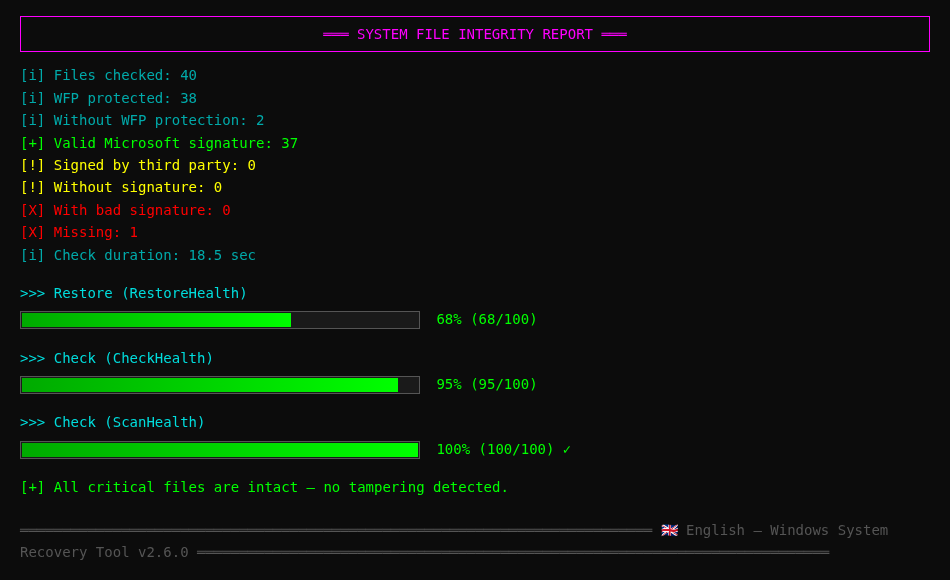
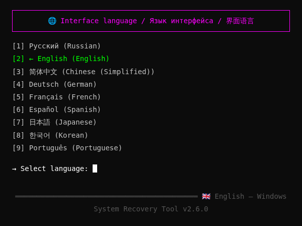
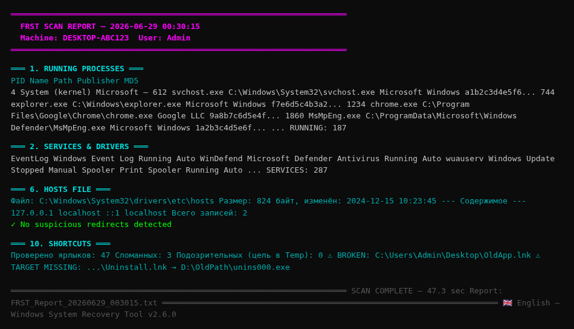
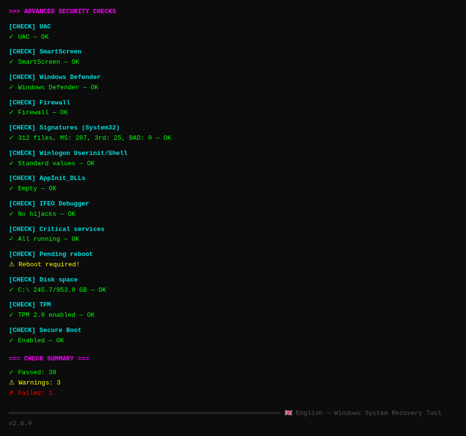
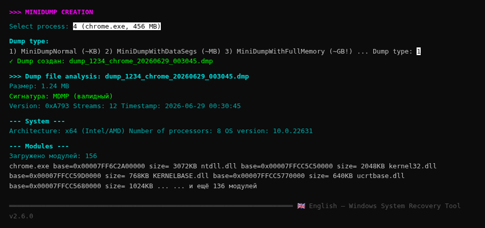

# 🔧 Windows System Recovery Tool

<div align="center">

🌐 **Available languages / Доступные языки / 可用语言 / Unterstützte Sprachen / Langues disponibles / Idiomas disponibles / 利用可能な言語 / 사용 가능한 언어 / Idiomas disponíveis:**

[🇷🇺 Русский](README.md) · [🇬🇧 English](README.en.md) · [🇨🇳 简体中文](README.zh.md) · [🇩🇪 Deutsch](README.de.md) · [🇫🇷 Français](README.fr.md) · [🇪🇸 Español](README.es.md) · [🇯🇵 日本語](README.ja.md) · [🇰🇷 한국어](README.ko.md) · [🇵🇹 Português](README.pt.md)

🌐 **Documentation with auto-detection**: https://ludonist.github.io/Windows-System-Recovery-Tool/

---


**Professional tool for recovering Windows 10/11 system files via direct Win32 API calls**

🌐 **Multilingual UI**: Russian · English · 简体中文 · Deutsch · Français · Español · 日本語 · 한국어 · Português

[Features](#-features) ·
[Screenshots](#-screenshots) ·
[Installation](#-installation) ·
[Usage](#-usage) ·
[Architecture](#-architecture) ·
[API](#-win32-apis-used) ·
[Build](#-building-from-source) ·
[Contributing](#-contributing)

</div>

---

## 📖 About

**Windows System Recovery Tool** is a console application for Windows 10/11 that recovers and verifies the integrity of system files through **direct Windows API calls** (`dismapi.dll`, `sfc.dll`, `wintrust.dll`, etc.) — not through external commands `cmd.exe` / `dism.exe` / `sfc.exe`.

### Key features

- 🎯 **67 operations** for recovery and diagnostics in one menu
- 🔌 **17 native Windows APIs** via P/Invoke (no shell commands)
- 🛡️ **File tampering detection**: WinVerifyTrust + certificate publisher
- 📊 **SHA256/SHA1 snapshots** to compare system state over time
- 🧩 **Microsoft.Dism NuGet** as an alternative managed path
- 📋 **Detailed logging** to `%LOCALAPPDATA%\SystemRestoreTool\`
- ⚡ **Self-contained build** — no .NET installation required
- 🌐 **9 Languages**: RU · EN · ZH · DE · FR · ES · JA · KO · PT

### Problems this tool solves

| Symptom | Solution |
|---------|----------|
| `sfc /scannow` finds corruption | DISM RestoreHealth + SFC /ScanNow |
| Suspected viral DLL tampering | WinVerifyTrust on all critical files |
| Windows Update broken | Reset SoftwareDistribution + re-register DLLs |
| Services won't start | Restart 40+ critical services via SCM |
| Bootloader failure | BCD check and recovery |
| No restore point | Create via `SRSetRestorePoint` |
| Icon/font cache corrupted | Rebuild IconCache.db / FNTCACHE.DAT |
| System integrity concerns | SHA256 snapshot + comparison with baseline |

---

## ✨ Features

### 1. Recovery via DISM API (`dismapi.dll`)

| Operation | Console equivalent |
|----------|---------------------|
| CheckHealth | `Dism /Online /Cleanup-Image /CheckHealth` |
| ScanHealth | `Dism /Online /Cleanup-Image /ScanHealth` |
| RestoreHealth | `Dism /Online /Cleanup-Image /RestoreHealth` |
| StartComponentCleanup | `Dism /Online /Cleanup-Image /StartComponentCleanup` |
| StartComponentCleanup + ResetBase | `... /StartComponentCleanup /ResetBase` |

### 2. SFC via native `sfc_os.dll`

| Operation | Equivalent |
|----------|------------|
| SfcSynchronousScan (ScanAndRepair) | `Sfc /ScanNow` |
| SfcSynchronousScan (VerifyOnly) | `Sfc /VerifyOnly` |
| SfcIsFileProtected | (no equivalent) |
| SfcGetNextProtectedFile | (no equivalent) |

### 3. Integrity check

- **40+ critical files** — kernel32.dll, ntdll.dll, winlogon.exe, lsass.exe, csrss.exe, smss.exe, drivers (tcpip.sys, ntfs.sys, volmgr.sys, ACPI.sys, hal.dll, ...) and more
- **Deep check System32 + drivers** — all .dll/.exe/.sys (~5000 files)
- **Full check System32 + SysWOW64** — ~10000 files
- For each file: WFP protection, Authenticode signature, publisher (Microsoft vs 3rd-party)

### 4. Recovery modules (14 modules)

| Module | Purpose | API |
|--------|---------|-----|
| `SystemRestorePointManager` | Restore points | `srclient.dll!SRSetRestorePoint` |
| `ServicesRepairManager` | Restart 40+ services | `advapi32.dll` SCM |
| `BootRecoveryManager` | BCD, bootmgr, winload | WMI + bcdedit |
| `RegistryRestoreManager` | Registry hive backup | `advapi32.dll!RegSaveKey` |
| `WindowsUpdateRepairManager` | WU reset | SCM + File API |
| `WinSxsRepairManager` | WinSxS cleanup | `dismapi.dll!DismAnalyzeComponentStore` |
| `EventLogManager` | Event logs | `wevtapi.dll!EvtClearLog` |
| `UserEnvRestoreManager` | Profiles, caches | advapi32 + File API |
| `FileHashDatabaseManager` | SHA256 snapshots | `System.Security.Cryptography` |
| `DeviceManager` | Devices | `setupapi.dll` |
| `PowerOptionsManager` | Power schemes | `powrprof.dll` |
| `NetworkDiagnosticManager` | Network | `winhttp.dll` + `ws2_32.dll` |
| `WerManager` | WER reports | `wer.dll` |
| `WindowsUpdateAgentManager` | Update search | COM WUA API |

---

## 📸 Screenshots

### Main Menu


### System file integrity check (with progress bars)



### Switch interface language



### FRST-Style full system scan



### Advanced security checks (40+ checks)



### MiniDump Manager — process analysis



---

## 📥 Installation

### Option 1: Download prebuilt EXE (recommended)

**Direct download links** (fresh build, no dependencies):

| Architecture | Standalone (includes .NET) | Compact (requires .NET 6) |
|--------------|----------------------------:|--------------------------:|
| **x64** (Intel/AMD) | [standalone-win-x64.zip](https://github.com/Ludonist/Windows-System-Recovery-Tool/releases/download/v2.5.1/SystemRestoreTool-standalone-win-x64.zip) (~40 MB) | [compact-win-x64.zip](https://github.com/Ludonist/Windows-System-Recovery-Tool/releases/download/v2.5.1/SystemRestoreTool-standalone-win-x64-compact.zip) (~7 MB) |
| **x86** (32-bit) | [standalone-win-x86.zip](https://github.com/Ludonist/Windows-System-Recovery-Tool/releases/download/v2.5.1/SystemRestoreTool-standalone-win-x86.zip) (~37 MB) | [compact-win-x86.zip](https://github.com/Ludonist/Windows-System-Recovery-Tool/releases/download/v2.5.1/SystemRestoreTool-standalone-win-x86-compact.zip) (~7 MB) |
| **ARM64** (Surface/Qualcomm) | [standalone-win-arm64.zip](https://github.com/Ludonist/Windows-System-Recovery-Tool/releases/download/v2.5.1/SystemRestoreTool-standalone-win-arm64.zip) (~33 MB) | [compact-win-arm64.zip](https://github.com/Ludonist/Windows-System-Recovery-Tool/releases/download/v2.5.1/SystemRestoreTool-standalone-win-arm64-compact.zip) (~6 MB) |

**Standalone version** (recommended) — includes .NET 6 Runtime, requires nothing else.

**Compact version** — requires [.NET Desktop Runtime 6.0+](https://dotnet.microsoft.com/download/dotnet/6.0).

### Option 2: GitHub Releases

All binaries are also available on the [Releases v2.5.1](https://github.com/Ludonist/Windows-System-Recovery-Tool/releases/tag/v2.5.1) page, along with SHA256 checksums for integrity verification.

### Option 3: Build from source

See [Building from source](#-building-from-source).

### Requirements

- **OS**: Windows 10 (build 19041+, May 2020 Update) or Windows 11
- **Architecture**: x64 / x86 / ARM64
- **Privileges**: Administrator (manifest already specifies this)
- **For compact build**: .NET Desktop Runtime 6.0+

### Verify integrity

After downloading, verify SHA256:
```cmd
certutil -hashfile SystemRestoreTool-standalone-win-x64.zip SHA256
```
Compare with the `.sha256` files next to each archive on the [Releases v2.5.1](https://github.com/Ludonist/Windows-System-Recovery-Tool/releases/tag/v2.5.1) page.

---

## 🚀 Usage

### Interactive mode

Run `SystemRestoreTool.exe` as administrator. A 73-item menu will open:

```
╔══════════════════════════════════════════════════════════════════════╗
║                                                                      ║
║   WINDOWS SYSTEM RECOVERY TOOL  v2.5.1                               ║
║   Direct recovery of Windows 10/11 system files                      ║
║   ...                                                                ║
╚══════════════════════════════════════════════════════════════════════╝
[+] Administrator privileges: CONFIRMED
[i] Log file: C:\Users\...\AppData\Local\SystemRestoreTool\srt_20260628_193015.log

MAIN MENU — System Restore Tool v2.5

  [ 1] ★ SUPER-FULL CYCLE: restore point + DISM + SFC + services + WU + caches
  [ 2]   FULL CYCLE (native API)
  [ 3]   FULL CYCLE (Microsoft.Dism NuGet)
  ...
  [67]   Exit

Select action: _
```

### Auto modes (for scripts)

```cmd
:: Super-full cycle: restore point + DISM + SFC + services + WU + caches
SystemRestoreTool.exe --super-full

:: Same + ResetBase WinSxS
SystemRestoreTool.exe --super-full --reset-base

:: Full DISM + SFC cycle
SystemRestoreTool.exe --full

:: Check 40+ critical files
SystemRestoreTool.exe --verify

:: Deep check System32 + drivers
SystemRestoreTool.exe --scan-all
```

### Logging

All operations are written simultaneously to the console (with color) and to a file:
```
%LOCALAPPDATA%\SystemRestoreTool\srt_YYYYMMDD_HHMMSS.log
```

### 🌐 Multilingual UI

The program supports **9 interface languages**:

| Code | Native name | English name |
|------|-------------|--------------|
| `ru` | Русский | Russian |
| `en` | English | English |
| `zh` | 简体中文 | Chinese (Simplified) |
| `de` | Deutsch | German |
| `fr` | Français | French |
| `es` | Español | Spanish |
| `ja` | 日本語 | Japanese |
| `ko` | 한국어 | Korean |
| `pt` | Português | Portuguese |

**To switch language:**
1. In the main menu, select item **70** ("🌐 Switch interface language")
2. Choose the desired language (1-9)
3. The choice is **saved to the registry** (`HKCU\SOFTWARE\SystemRestoreTool\Language`) and applied on next launch

Translation files: `Resources/strings.{ru,en,zh,de,fr,es,ja,ko,pt}.json`. They are embedded in the EXE as embedded resources, so nothing else needs to be copied.

**To add a new language:**
1. Copy `Resources/strings.en.json` to `Resources/strings.xx.json` (where `xx` is the language code)
2. Translate all values
3. Add the code to `Localizer.SupportedLanguages` and `LanguageNames`
4. Add an entry to `.csproj` as `<EmbeddedResource>`

---

## 🏗 Architecture

```
Windows-System-Recovery-Tool/
├── SystemRestoreTool.csproj      .NET 6.0, x64/x86/ARM64, Microsoft.Dism NuGet
├── app.manifest                  requireAdministrator
├── Program.cs                    Entry point, 73-item menu
│
├── Api/                          P/Invoke layer (native Windows DLLs)
│   ├── DismNativeApi.cs          dismapi.dll (DISM API)
│   ├── SfcNativeApi.cs           sfc.dll + sfc_os.dll + srclient.dll
│   ├── WinTrustNativeApi.cs      wintrust.dll + crypt32.dll (signatures)
│   ├── Kernel32NativeApi.cs      kernel32.dll + advapi32.dll
│   ├── SrclientNativeApi.cs      srclient.dll (restore points)
│   ├── ServicesNativeApi.cs      advapi32.dll (Service Control Manager)
│   ├── EventLogNativeApi.cs      advapi32.dll + wevtapi.dll
│   ├── VssNativeApi.cs           vssapi.dll (Volume Shadow Copy)
│   ├── WerNativeApi.cs           wer.dll (Windows Error Reporting)
│   ├── SetupApiNativeApi.cs      setupapi.dll (devices)
│   ├── PowerNativeApi.cs         powrprof.dll (power)
│   └── NetNativeApi.cs           winhttp.dll + wininet.dll + ws2_32.dll
│
├── Engine/                       High-level logic
│   ├── SystemRestoreEngine.cs    Recovery cycle orchestration
│   ├── DismManagedWrapper.cs     Via Microsoft.Dism NuGet
│   ├── SignatureVerifier.cs      High-level signature verification
│   ├── IntegrityChecker.cs       Check 40+ critical + all System32
│   └── Modules/                  Specialized modules (19)
│       ├── SystemRestorePointManager.cs
│       ├── ServicesRepairManager.cs
│       ├── BootRecoveryManager.cs
│       ├── RegistryRestoreManager.cs
│       ├── WindowsUpdateRepairManager.cs
│       ├── WinSxsRepairManager.cs
│       ├── EventLogManager.cs
│       ├── UserEnvRestoreManager.cs
│       ├── FileHashDatabaseManager.cs
│       ├── DeviceManager.cs
│       ├── PowerOptionsManager.cs
│       ├── NetworkDiagnosticManager.cs
│       ├── WerManager.cs
│       ├── WindowsUpdateAgentManager.cs
│       ├── MiniDumpManager.cs
│       ├── FrstScanner.cs
│       ├── AdvancedChecksManager.cs
│       ├── HostsFileManager.cs
│       └── StartupManager.cs
│
├── Resources/                    🌐 Localization (embedded resources)
│   ├── strings.ru.json           Russian (default)
│   ├── strings.en.json           English
│   └── strings.zh.json           简体中文
│
├── Utils/
│   ├── ConsoleHelper.cs          UI helper (menu, privileges, input)
│   ├── Logger.cs                 File + colored console logger
│   └── Localizer.cs              Language loading and switching
│
├── docs/
│   ├── api-reference.md          Detailed Win32 API reference
│   ├── screenshots/              Program screenshots (PNG)
│   └── site/                     GitHub Pages site
│
├── .github/
│   ├── repo-metadata.json        Topics and repo description
│   └── workflows/
│       └── build-release.yml     CI: build x86/x64/ARM64 + Release
│
├── .gitignore                    Standard .NET gitignore
├── .editorconfig                 Code style
├── LICENSE                       MIT
├── CHANGELOG.md                  Change history
├── CONTRIBUTING.md               Rules for contributors
├── SECURITY.md                   Security policy
├── README.md                     Russian documentation (default)
├── README.en.md                  English documentation
└── README.zh.md                  Chinese documentation
```

### Code statistics

- **~7200 lines of C#** code
- **37 files** in 6 directories
- **17 native DLLs** via P/Invoke
- **19 recovery modules**
- **73 menu items**
- **9 interface languages** (RU/EN/ZH/DE/FR/ES/JA/KO/PT)

---

## 🔌 Win32 APIs used

All operations use **direct P/Invoke calls** (no shell commands):

| DLL | Purpose |
|-----|-----------|
| `dismapi.dll` | DISM: CheckHealth / ScanHealth / RestoreHealth / StartComponentCleanup |
| `sfc.dll` | SfcIsFileProtected / SfcGetNextProtectedFile |
| `sfc_os.dll` | SfcSynchronousScan (= Sfc /ScanNow) |
| `wintrust.dll` | WinVerifyTrust (Authenticode signatures) |
| `crypt32.dll` | CryptQueryObject / CertGetNameString (publisher) |
| `srclient.dll` | SRSetRestorePoint (restore points) |
| `advapi32.dll` | SCM (services), registry, privileges |
| `kernel32.dll` | Files, reboot, App Recovery/Restart |
| `wevtapi.dll` | Event logs (EvtClearLog) |
| `vssapi.dll` | Volume Shadow Copy |
| `wer.dll` | Windows Error Reporting |
| `setupapi.dll` | Device installer |
| `cfgmgr32.dll` | CM_Reenumerate_DevNode |
| `powrprof.dll` | Power schemes, battery |
| `winhttp.dll` | HTTP server checks |
| `wininet.dll` | InternetGetConnectedState |
| `ws2_32.dll` | Winsock (WSAStartup) |
| **Microsoft.Dism NuGet** | Managed DISM API wrapper |
| **COM WUA API** | Windows Update Agent (`Microsoft.Update.Session`) |

Details in [docs/api-reference.md](docs/api-reference.md).

---

## 🛠 Building from source

### Requirements

- **Windows 10** (build 19041+) or **Windows 11**
- **.NET 6.0 SDK** or newer — https://dotnet.microsoft.com/download
- (Optional) Visual Studio 2022 / JetBrains Rider / VS Code

### Steps

```bash
git clone https://github.com/Ludonist/Windows-System-Recovery-Tool.git
cd Windows-System-Recovery-Tool
dotnet restore
dotnet build -c Release
```

Result: `bin\Release\net6.0-windows10.0.19041.0\win-x64\SystemRestoreTool.exe`

### Single-file publish

```bash
# Compact (requires .NET 6 on target machine, ~27 MB)
dotnet publish -c Release -r win-x64 --self-contained false -p:PublishSingleFile=true

# Self-contained (no dependencies, ~45 MB)
dotnet publish -c Release -r win-x64 --self-contained true \
  -p:PublishSingleFile=true \
  -p:IncludeNativeLibrariesForSelfExtract=true \
  -p:EnableCompressionInSingleFile=true
```

### Supported architectures

```bash
# x64 (Intel/AMD 64-bit) — primary
dotnet publish -c Release -r win-x64 ...

# x86 (32-bit) — for older systems
dotnet publish -c Release -r win-x86 ...

# ARM64 (Surface Pro X, Snapdragon laptops)
dotnet publish -c Release -r win-arm64 -p:PublishReadyToRun=false ...
```

---

## 📋 List of checked files

### 40+ critical files (`IntegrityChecker.CriticalFiles`)

- **Base DLLs**: kernel32.dll, ntdll.dll, user32.dll, advapi32.dll, shell32.dll, ole32.dll, gdi32.dll, msvcrt.dll, ws2_32.dll, wininet.dll, urlmon.dll, combase.dll, sechost.dll, rpcrt4.dll, setupapi.dll
- **Loaders and processes**: winload.exe, winresume.exe, winlogon.exe, csrss.exe, services.exe, lsass.exe, lsaiso.exe, smss.exe, svchost.exe, spoolsv.exe, wininit.exe, dwm.exe
- **Cryptography**: bcrypt.dll, ncrypt.dll, schannel.dll, crypt32.dll, cryptbase.dll, cryptsp.dll, wintrust.dll, msasn1.dll
- **DISM/SFC**: sfc.dll, sfc_os.dll, dismapi.dll, dism.exe, sfc.exe
- **Management**: mmc.exe, powershell.exe, cmd.exe, regedit.exe, taskmgr.exe, eventvwr.exe
- **Shell**: explorer.exe, shdocvw.dll, shellstyle.dll, themecpl.dll, themeui.dll
- **Kernel drivers**: tcpip.sys, ntfs.sys, volmgr.sys, volmgrx.sys, disk.sys, partmgr.sys, ACPI.sys, hal.dll, ndis.sys, http.sys, Wdf01000.sys, ksecdd.sys, ksecpkg.sys, msisadrv.sys, pci.sys, mountmgr.sys, fltMgr.sys, luafv.sys, mrxsmb.sys, mup.sys
- **.NET Framework**: clr.dll, mscorlib.dll, System.dll
- **WinRT**: Windows.Foundation.winmd, WinRTTraceLogger.dll
- **WSL**: lxss.dll, wslapi.dll

### Deep check (System32 + drivers)

- All `.dll`, `.exe`, `.sys`, `.cpl` in `C:\Windows\System32`
- All `.sys` in `C:\Windows\System32\drivers`
- UMDF drivers: `C:\Windows\System32\drivers\UMDF`
- Windows Defender drivers: `C:\Windows\System32\drivers\wd`
- All `.exe`, `.dll` in `C:\Windows`

### Full check

Additionally: `C:\Windows\SysWOW64` (32-bit versions of system libraries)

---

## 📊 Sample report

```
[i] Files checked:                40
[i] WFP-protected:                38
[i] Without WFP protection:       2
[+] Valid Microsoft signature:    37
[!] Signed by third party:        0
[!] Without signature:            0
[X] With bad signature:           0
[X] Missing:                      1
[i] Check duration:               18.5 sec

All critical files are intact — no tampering detected.
```

---

## 🔒 Security

- ✅ The program **does not launch** `cmd.exe`, `dism.exe`, `sfc.exe`, `powershell.exe` (except `bcdedit.exe` and `netsh.exe` for operations without P/Invoke equivalents)
- ✅ All operations use native Win32 APIs
- ✅ Administrator privileges required (manifest `requireAdministrator`)
- ✅ Logs are written **locally** to `%LOCALAPPDATA%\SystemRestoreTool\`
- ✅ No data is sent over the network
- ✅ Open-source under MIT license — you can audit the code

## ⚠️ Limitations

1. **Windows 10/11 only** — for Windows 7/8 you'd need to change `TargetFramework`
2. **RestoreHealth** may require access to Windows Update or installation media
3. **SfcSynchronousScan** is undocumented — on some builds it may need additional flags
4. **ResetBase** is irreversible — after it, you can't uninstall installed updates
5. **bcdedit / bootrec** have no P/Invoke equivalents — called via `Process.Start` directly (no cmd.exe)
6. **RegSaveKey** for live hives may fail (files are locked by the system) — in that case, direct file copying is used

---

## 📈 Roadmap

- [ ] GUI version (WPF) with graphics
- [ ] Interface localization (more languages: Italian, Arabic, Hindi, Vietnamese)
- [ ] Automatic detection of "broken" packages via CBS.log
- [ ] Windows Server 2022/2025 support as separate profiles
- [ ] Task scheduler (e.g., weekly integrity check)
- [ ] Export reports to HTML/PDF

See [open issues](https://github.com/Ludonist/Windows-System-Recovery-Tool/issues) for the full list.

---

## 🤝 Contributing

Pull requests are welcome! See [CONTRIBUTING.md](CONTRIBUTING.md) for rules.

Especially needed:
- 🌍 Translating the interface to other languages
- 🐛 Bug reports with real crash logs
- 📚 Documentation of edge cases on different Windows builds
- 🧪 Tests on ARM64 devices (Surface Pro X, etc.)

---

## 📄 License

MIT License — see [LICENSE](LICENSE).

You are free to use, modify, and distribute this code.

---

## 🙏 Acknowledgements

- [Microsoft.Dism NuGet](https://github.com/jeffkl/ManagedDism) — managed DISM API wrapper by Jeff Kluge
- [Microsoft Learn Win32 API List](https://learn.microsoft.com/windows/win32/apiindex/windows-api-list) — Windows API documentation
- [pinvoke.net](https://www.pinvoke.net/) — P/Invoke signatures reference
- [Farbar Recovery Scan Tool (FRST)](https://www.bleepingcomputer.com/download/farbar-recovery-scan-tool/) — inspiration for the FRST-style scanner module

---

## ⭐ Star History

If you found this program useful — give the repo a ⭐!

<div align="center">

**[⬆ Back to top](#-windows-system-recovery-tool)**

Made with ❤️ for Windows power users

</div>
