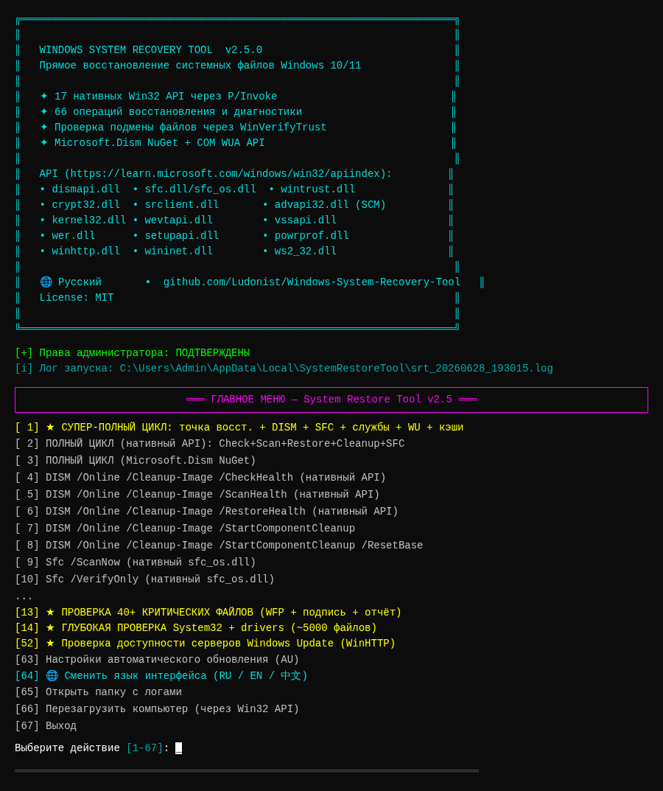
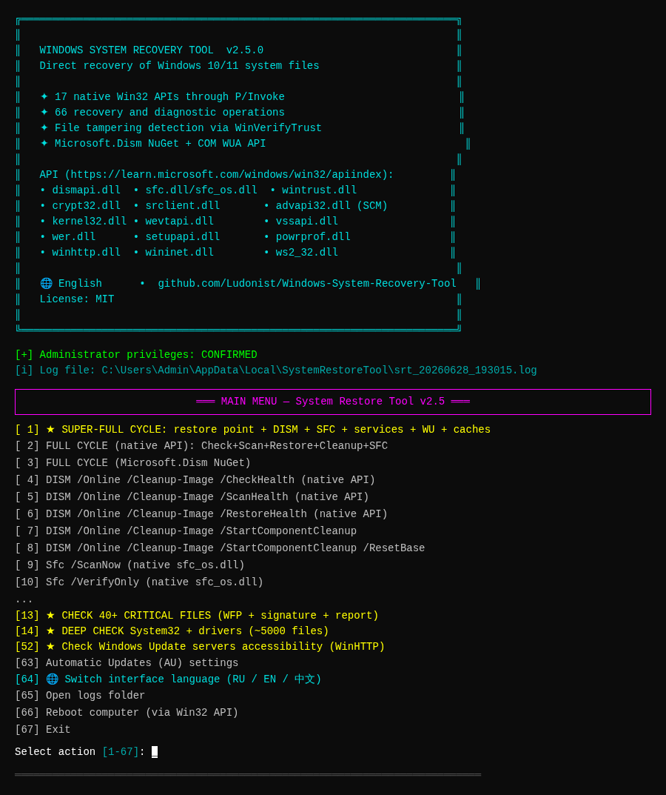
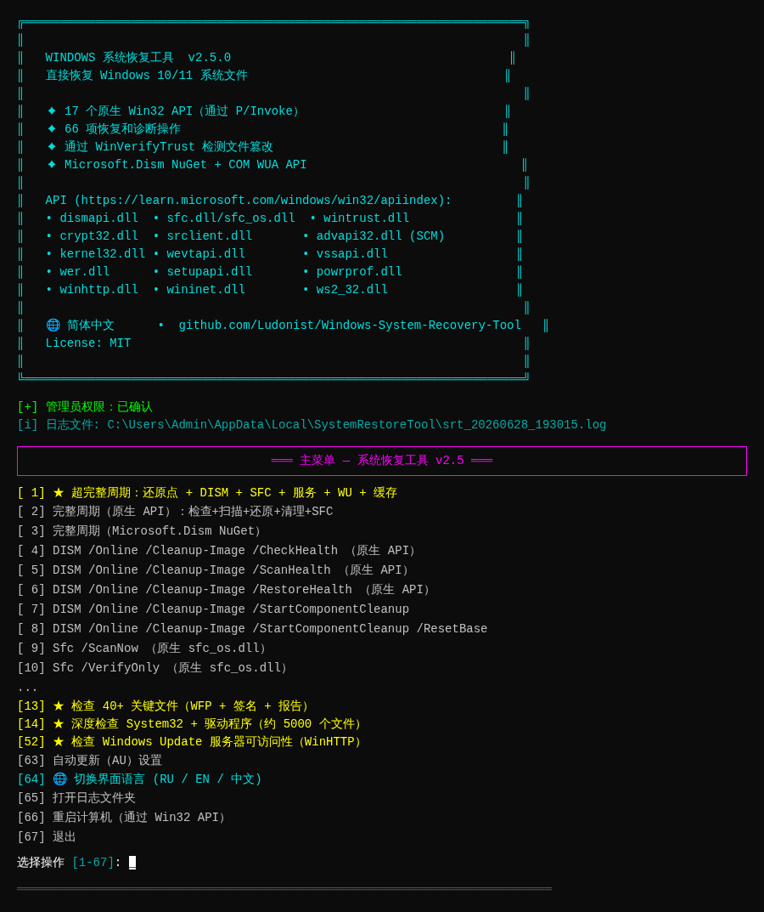
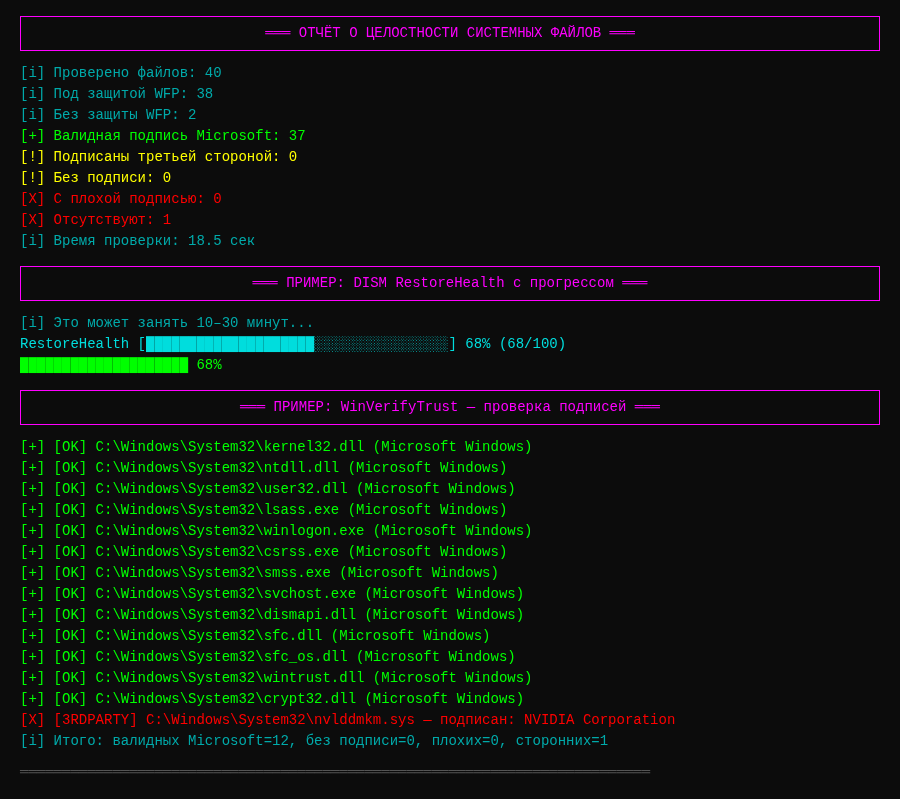
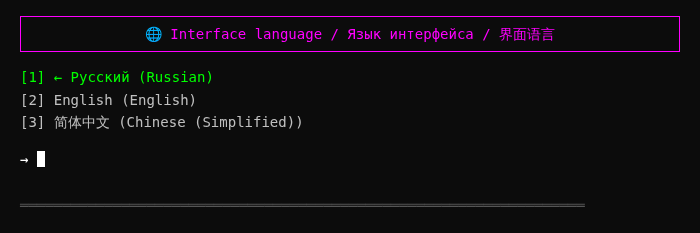

# 🔧 Herramienta de Recuperación del Sistema Windows

<div align="center">

🌐 **Idiomas disponibles / Available languages / 可用语言 / Unterstützte Sprachen / Langues disponibles / Idiomas disponibles / 利用可能な言語 / 사용 가능한 언어 / Idiomas disponíveis:**

[🇷🇺 Русский](README.md) · [🇬🇧 English](README.en.md) · [🇨🇳 简体中文](README.zh.md) · [🇩🇪 Deutsch](README.de.md) · [🇫🇷 Français](README.fr.md) · [🇪🇸 Español](README.es.md) · [🇯🇵 日本語](README.ja.md) · [🇰🇷 한국어](README.ko.md) · [🇵🇹 Português](README.pt.md)

🌐 **Documentación con detección automática de idioma**: https://ludonist.github.io/Windows-System-Recovery-Tool/

---


**Herramienta profesional para recuperar archivos del sistema Windows 10/11 mediante llamadas directas a la API Win32**

🌐 **Interfaz multilingüe**: Русский · English · 简体中文 · Deutsch · Français · Español · 日本語 · 한국어 · Português

[Funciones](#-features) ·
[Capturas de pantalla](#-screenshots) ·
[Instalación](#-installation) ·
[Uso](#-usage) ·
[Arquitectura](#-architecture) ·
[API](#-win32-apis-used) ·
[Compilación](#-building-from-source) ·
[Contribuir](#-contributing)

</div>

---

## 📖 Acerca de

**Herramienta de Recuperación del Sistema Windows** es una aplicación de consola para Windows 10/11 que recupera y verifica la integridad de los archivos del sistema mediante **llamadas directas a la API de Windows** (`dismapi.dll`, `sfc.dll`, `wintrust.dll`, etc.) — no mediante comandos externos `cmd.exe` / `dism.exe` / `sfc.exe`.

### Características principales

- 🎯 **67 operaciones** de recuperación y diagnóstico en un solo menú
- 🔌 **17 API nativas de Windows** mediante P/Invoke (sin comandos de shell)
- 🛡️ **Detección de manipulación de archivos**: WinVerifyTrust + editor del certificado
- 📊 **Instantáneas SHA256/SHA1** para comparar el estado del sistema a lo largo del tiempo
- 🧩 **Microsoft.Dism NuGet** como ruta administrada alternativa
- 📋 **Registro detallado** en `%LOCALAPPDATA%\SystemRestoreTool\`
- ⚡ **Compilación autónoma** — no requiere instalación de .NET
- 🌐 **Interfaz multilingüe**: Русский / English / 简体中文 / Deutsch / Français / Español / 日本語 / 한국어 / Português

### Problemas que resuelve esta herramienta

| Síntoma | Solución |
|---------|----------|
| `sfc /scannow` detecta corrupción | DISM RestoreHealth + SFC /ScanNow |
| Sospecha de manipulación viral de DLL | WinVerifyTrust en todos los archivos críticos |
| Windows Update roto | Restablecer SoftwareDistribution + volver a registrar DLL |
| Los servicios no inician | Reiniciar 40+ servicios críticos vía SCM |
| Fallo del gestor de arranque | Comprobación y recuperación BCD |
| Sin punto de restauración | Crear vía `SRSetRestorePoint` |
| Caché de iconos/fuentes dañado | Reconstruir IconCache.db / FNTCACHE.DAT |
| Preocupaciones de integridad del sistema | Instantánea SHA256 + comparación con la línea base |

---

## ✨ Funciones

### 1. Recuperación mediante la API DISM (`dismapi.dll`)

| Operación | Equivalente en consola |
|----------|---------------------|
| CheckHealth | `Dism /Online /Cleanup-Image /CheckHealth` |
| ScanHealth | `Dism /Online /Cleanup-Image /ScanHealth` |
| RestoreHealth | `Dism /Online /Cleanup-Image /RestoreHealth` |
| StartComponentCleanup | `Dism /Online /Cleanup-Image /StartComponentCleanup` |
| StartComponentCleanup + ResetBase | `... /StartComponentCleanup /ResetBase` |

### 2. SFC mediante `sfc_os.dll` nativo

| Operación | Equivalente |
|----------|------------|
| SfcSynchronousScan (ScanAndRepair) | `Sfc /ScanNow` |
| SfcSynchronousScan (VerifyOnly) | `Sfc /VerifyOnly` |
| SfcIsFileProtected | (sin equivalente) |
| SfcGetNextProtectedFile | (sin equivalente) |

### 3. Verificación de integridad

- **40+ archivos críticos** — kernel32.dll, ntdll.dll, winlogon.exe, lsass.exe, csrss.exe, smss.exe, controladores (tcpip.sys, ntfs.sys, volmgr.sys, ACPI.sys, hal.dll, ...) y más
- **Verificación profunda System32 + controladores** — todos los .dll/.exe/.sys (~5000 archivos)
- **Verificación completa System32 + SysWOW64** — ~10000 archivos
- Para cada archivo: protección WFP, firma Authenticode, editor (Microsoft vs terceros)

### 4. Módulos de recuperación (14 módulos)

| Módulo | Propósito | API |
|--------|---------|-----|
| `SystemRestorePointManager` | Puntos de restauración | `srclient.dll!SRSetRestorePoint` |
| `ServicesRepairManager` | Reiniciar 40+ servicios | `advapi32.dll` SCM |
| `BootRecoveryManager` | BCD, bootmgr, winload | WMI + bcdedit |
| `RegistryRestoreManager` | Copia de seguridad de hive del Registro | `advapi32.dll!RegSaveKey` |
| `WindowsUpdateRepairManager` | Restablecer WU | SCM + File API |
| `WinSxsRepairManager` | Limpieza WinSxS | `dismapi.dll!DismAnalyzeComponentStore` |
| `EventLogManager` | Registros de eventos | `wevtapi.dll!EvtClearLog` |
| `UserEnvRestoreManager` | Perfiles, cachés | advapi32 + File API |
| `FileHashDatabaseManager` | Instantáneas SHA256 | `System.Security.Cryptography` |
| `DeviceManager` | Dispositivos | `setupapi.dll` |
| `PowerOptionsManager` | Esquemas de energía | `powrprof.dll` |
| `NetworkDiagnosticManager` | Red | `winhttp.dll` + `ws2_32.dll` |
| `WerManager` | Informes WER | `wer.dll` |
| `WindowsUpdateAgentManager` | Búsqueda de actualizaciones | COM WUA API |

---

## 📸 Capturas de pantalla

### Menú principal (Ruso)



### Menú principal (Inglés)



### 主菜单 (简体中文)



### Verificación de integridad de archivos del sistema



### Cambiar idioma de la interfaz



---

## 📥 Instalación

### Opción 1: Descargar EXE precompilado (recomendado)

**Enlaces de descarga directa** (compilación reciente, sin dependencias):

| Arquitectura | Independiente (incluye .NET) | Compacto (requiere .NET 6) |
|--------------|----------------------------:|--------------------------:|
| **x64** (Intel/AMD) | [standalone-win-x64.zip](https://github.com/Ludonist/Windows-System-Recovery-Tool/releases/download/v2.5.1/SystemRestoreTool-standalone-win-x64.zip) (~40 MB) | [compact-win-x64.zip](https://github.com/Ludonist/Windows-System-Recovery-Tool/releases/download/v2.5.1/SystemRestoreTool-standalone-win-x64-compact.zip) (~7 MB) |
| **x86** (32-bit) | [standalone-win-x86.zip](https://github.com/Ludonist/Windows-System-Recovery-Tool/releases/download/v2.5.1/SystemRestoreTool-standalone-win-x86.zip) (~37 MB) | [compact-win-x86.zip](https://github.com/Ludonist/Windows-System-Recovery-Tool/releases/download/v2.5.1/SystemRestoreTool-standalone-win-x86-compact.zip) (~7 MB) |
| **ARM64** (Surface/Qualcomm) | [standalone-win-arm64.zip](https://github.com/Ludonist/Windows-System-Recovery-Tool/releases/download/v2.5.1/SystemRestoreTool-standalone-win-arm64.zip) (~33 MB) | [compact-win-arm64.zip](https://github.com/Ludonist/Windows-System-Recovery-Tool/releases/download/v2.5.1/SystemRestoreTool-standalone-win-arm64-compact.zip) (~6 MB) |

**Versión independiente** (recomendada) — incluye .NET 6 Runtime, no requiere nada más.

**Versión compacta** — requiere [.NET Desktop Runtime 6.0+](https://dotnet.microsoft.com/download/dotnet/6.0).

### Opción 2: GitHub Releases

Todos los binarios también están disponibles en la página [Releases v2.5.1](https://github.com/Ludonist/Windows-System-Recovery-Tool/releases/tag/v2.5.1), junto con sumas de comprobación SHA256 para verificar la integridad.

### Opción 3: Compilar desde el código fuente

Ver [Compilar desde el código fuente](#-building-from-source).

### Requisitos

- **SO**: Windows 10 (build 19041+, May 2020 Update) o Windows 11
- **Arquitectura**: x64 / x86 / ARM64
- **Privilegios**: Administrador (el manifiesto ya lo especifica)
- **Para build compacto**: .NET Desktop Runtime 6.0+

### Verificar integridad

Tras la descarga, verificar SHA256:
```cmd
certutil -hashfile SystemRestoreTool-standalone-win-x64.zip SHA256
```
Comparar con los archivos `.sha256` junto a cada archivo en la página [Releases v2.5.1](https://github.com/Ludonist/Windows-System-Recovery-Tool/releases/tag/v2.5.1).

---

## 🚀 Uso

### Modo interactivo

Ejecute `SystemRestoreTool.exe` como administrador. Se abrirá un menú de 67 elementos:

```
╔══════════════════════════════════════════════════════════════════════╗
║                                                                      ║
║   WINDOWS SYSTEM RECOVERY TOOL  v2.5.1                               ║
║   Direct recovery of Windows 10/11 system files                      ║
║   ...                                                                ║
╚══════════════════════════════════════════════════════════════════════╝
[+] Administrator privileges: CONFIRMED
[i] Log file: C:\Users\...\AppData\Local\SystemRestoreTool\srt_20260628_193015.log

MAIN MENU — System Restore Tool v2.5

  [ 1] ★ SUPER-FULL CYCLE: restore point + DISM + SFC + services + WU + caches
  [ 2]   FULL CYCLE (native API)
  [ 3]   FULL CYCLE (Microsoft.Dism NuGet)
  ...
  [67]   Exit

Select action: _
```

### Modos automáticos (para scripts)

```cmd
:: Super-full cycle: restore point + DISM + SFC + services + WU + caches
SystemRestoreTool.exe --super-full

:: Same + ResetBase WinSxS
SystemRestoreTool.exe --super-full --reset-base

:: Full DISM + SFC cycle
SystemRestoreTool.exe --full

:: Check 40+ critical files
SystemRestoreTool.exe --verify

:: Deep check System32 + drivers
SystemRestoreTool.exe --scan-all
```

### Registro

Todas las operaciones se escriben simultáneamente en la consola (con color) y en un archivo:
```
%LOCALAPPDATA%\SystemRestoreTool\srt_YYYYMMDD_HHMMSS.log
```

### 🌐 Interfaz multilingüe

El programa admite **3 idiomas de interfaz**:

| Código | Nombre nativo | Nombre en inglés |
|------|-------------|--------------|
| `ru` | Русский | Russian |
| `en` | English | English |
| `zh` | 简体中文 | Chinese (Simplified) |

**Para cambiar de idioma:**
1. En el menú principal, seleccione el elemento **64** ("🌐 Switch interface language")
2. Elija el idioma deseado (1-3)
3. La elección se **guarda en el Registro** (`HKCU\SOFTWARE\SystemRestoreTool\Language`) y se aplica en el próximo inicio

Archivos de traducción: `Resources/strings.{ru,en,zh}.json`. Están incrustados en el EXE como recursos incrustados, por lo que no es necesario copiar nada más.

**Para añadir un nuevo idioma:**
1. Copie `Resources/strings.en.json` a `Resources/strings.xx.json` (`xx` = código de idioma)
2. Traduzca todos los valores
3. Añada el código a `Localizer.SupportedLanguages` y `LanguageNames`
4. Añada una entrada en `.csproj` como `<EmbeddedResource>`

---

## 🏗 Arquitectura

```
Windows-System-Recovery-Tool/
├── SystemRestoreTool.csproj      .NET 6.0, x64/x86/ARM64, Microsoft.Dism NuGet
├── app.manifest                  requireAdministrator
├── Program.cs                    Punto de entrada, menú de 67 elementos
│
├── Api/                          Capa P/Invoke (DLLs nativas de Windows)
│   ├── DismNativeApi.cs          dismapi.dll (API DISM)
│   ├── SfcNativeApi.cs           sfc.dll + sfc_os.dll + srclient.dll
│   ├── WinTrustNativeApi.cs      wintrust.dll + crypt32.dll (firmas)
│   ├── Kernel32NativeApi.cs      kernel32.dll + advapi32.dll
│   ├── SrclientNativeApi.cs      srclient.dll (puntos de restauración)
│   ├── ServicesNativeApi.cs      advapi32.dll (Service Control Manager)
│   ├── EventLogNativeApi.cs      advapi32.dll + wevtapi.dll
│   ├── VssNativeApi.cs           vssapi.dll (Volume Shadow Copy)
│   ├── WerNativeApi.cs           wer.dll (Windows Error Reporting)
│   ├── SetupApiNativeApi.cs      setupapi.dll (dispositivos)
│   ├── PowerNativeApi.cs         powrprof.dll (energía)
│   └── NetNativeApi.cs           winhttp.dll + wininet.dll + ws2_32.dll
│
├── Engine/                       Lógica de alto nivel
│   ├── SystemRestoreEngine.cs    Orquestación del ciclo de recuperación
│   ├── DismManagedWrapper.cs     Vía Microsoft.Dism NuGet
│   ├── SignatureVerifier.cs      Verificación de firma de alto nivel
│   ├── IntegrityChecker.cs       Verifica 40+ archivos críticos + todo System32
│   └── Modules/                  Módulos especializados (14)
│       ├── SystemRestorePointManager.cs
│       ├── ServicesRepairManager.cs
│       ├── BootRecoveryManager.cs
│       ├── RegistryRestoreManager.cs
│       ├── WindowsUpdateRepairManager.cs
│       ├── WinSxsRepairManager.cs
│       ├── EventLogManager.cs
│       ├── UserEnvRestoreManager.cs
│       ├── FileHashDatabaseManager.cs
│       ├── DeviceManager.cs
│       ├── PowerOptionsManager.cs
│       ├── NetworkDiagnosticManager.cs
│       ├── WerManager.cs
│       └── WindowsUpdateAgentManager.cs
│
├── Resources/                    🌐 Localización (recursos incrustados)
│   ├── strings.ru.json           Русский (predeterminado)
│   ├── strings.en.json           English
│   └── strings.zh.json           简体中文
│
├── Utils/
│   ├── ConsoleHelper.cs          Ayuda de UI (menú, privilegios, entrada)
│   ├── Logger.cs                 Logger de archivo + consola coloreada
│   └── Localizer.cs              Carga y cambio de idioma
│
├── docs/
│   ├── api-reference.md          Referencia detallada de la API Win32
│   └── screenshots/              Capturas de pantalla del programa (PNG)
│
├── .github/
│   ├── repo-metadata.json        Topics y descripción del repositorio
│   └── workflows/
│       └── build-release.yml     CI: build x86/x64/ARM64 + Release
│
├── .gitignore                    .gitignore .NET estándar
├── .editorconfig                 Estilo de código
├── LICENSE                       MIT
├── CHANGELOG.md                  Historial de cambios
├── CONTRIBUTING.md               Reglas para contribuidores
├── SECURITY.md                   Política de seguridad
├── README.md                     Documentación rusa (predeterminada)
├── README.en.md                  Documentación inglesa
└── README.zh.md                  Documentación china
```

### Estadísticas del código

- **~7200 líneas de código C#**
- **37 archivos** en 6 directorios
- **17 DLLs nativas** vía P/Invoke
- **14 módulos de recuperación**
- **67 elementos de menú**
- **3 idiomas de interfaz** (RU/EN/ZH)

---

## 🔌 API Win32 utilizadas

Todas las operaciones utilizan **llamadas P/Invoke directas** (sin comandos de shell):

| DLL | Propósito |
|-----|-----------|
| `dismapi.dll` | DISM: CheckHealth / ScanHealth / RestoreHealth / StartComponentCleanup |
| `sfc.dll` | SfcIsFileProtected / SfcGetNextProtectedFile |
| `sfc_os.dll` | SfcSynchronousScan (= Sfc /ScanNow) |
| `wintrust.dll` | WinVerifyTrust (firmas Authenticode) |
| `crypt32.dll` | CryptQueryObject / CertGetNameString (editor) |
| `srclient.dll` | SRSetRestorePoint (puntos de restauración) |
| `advapi32.dll` | SCM (servicios), registro, privilegios |
| `kernel32.dll` | Archivos, reinicio, App Recovery/Restart |
| `wevtapi.dll` | Registros de eventos (EvtClearLog) |
| `vssapi.dll` | Volume Shadow Copy |
| `wer.dll` | Windows Error Reporting |
| `setupapi.dll` | Instalador de dispositivos |
| `cfgmgr32.dll` | CM_Reenumerate_DevNode |
| `powrprof.dll` | Esquemas de energía, batería |
| `winhttp.dll` | Comprobaciones de servidor HTTP |
| `wininet.dll` | InternetGetConnectedState |
| `ws2_32.dll` | Winsock (WSAStartup) |
| **Microsoft.Dism NuGet** | Wrapper administrado de la API DISM |
| **COM WUA API** | Windows Update Agent (`Microsoft.Update.Session`) |

Detalles en [docs/api-reference.md](docs/api-reference.md).

---

## 🛠 Compilar desde el código fuente

### Requisitos

- **Windows 10** (build 19041+) o **Windows 11**
- **.NET 6.0 SDK** o más reciente — https://dotnet.microsoft.com/download
- (Opcional) Visual Studio 2022 / JetBrains Rider / VS Code

### Pasos

```bash
git clone https://github.com/Ludonist/Windows-System-Recovery-Tool.git
cd Windows-System-Recovery-Tool
dotnet restore
dotnet build -c Release
```

Resultado: `bin\Release\net6.0-windows10.0.19041.0\win-x64\SystemRestoreTool.exe`

### Publicación de archivo único

```bash
# Compacto (requiere .NET 6 en la máquina destino, ~27 MB)
dotnet publish -c Release -r win-x64 --self-contained false -p:PublishSingleFile=true

# Autónomo (sin dependencias, ~45 MB)
dotnet publish -c Release -r win-x64 --self-contained true \
  -p:PublishSingleFile=true \
  -p:IncludeNativeLibrariesForSelfExtract=true \
  -p:EnableCompressionInSingleFile=true
```

### Arquitecturas admitidas

```bash
# x64 (Intel/AMD 64-bit) — principal
dotnet publish -c Release -r win-x64 ...

# x86 (32-bit) — para sistemas antiguos
dotnet publish -c Release -r win-x86 ...

# ARM64 (Surface Pro X, portátiles Snapdragon)
dotnet publish -c Release -r win-arm64 -p:PublishReadyToRun=false ...
```

---

## 📋 Lista de archivos verificados

### 40+ archivos críticos (`IntegrityChecker.CriticalFiles`)

- **DLLs base**: kernel32.dll, ntdll.dll, user32.dll, advapi32.dll, shell32.dll, ole32.dll, gdi32.dll, msvcrt.dll, ws2_32.dll, wininet.dll, urlmon.dll, combase.dll, sechost.dll, rpcrt4.dll, setupapi.dll
- **Cargadores y procesos**: winload.exe, winresume.exe, winlogon.exe, csrss.exe, services.exe, lsass.exe, lsaiso.exe, smss.exe, svchost.exe, spoolsv.exe, wininit.exe, dwm.exe
- **Criptografía**: bcrypt.dll, ncrypt.dll, schannel.dll, crypt32.dll, cryptbase.dll, cryptsp.dll, wintrust.dll, msasn1.dll
- **DISM/SFC**: sfc.dll, sfc_os.dll, dismapi.dll, dism.exe, sfc.exe
- **Gestión**: mmc.exe, powershell.exe, cmd.exe, regedit.exe, taskmgr.exe, eventvwr.exe
- **Shell**: explorer.exe, shdocvw.dll, shellstyle.dll, themecpl.dll, themeui.dll
- **Controladores del núcleo**: tcpip.sys, ntfs.sys, volmgr.sys, volmgrx.sys, disk.sys, partmgr.sys, ACPI.sys, hal.dll, ndis.sys, http.sys, Wdf01000.sys, ksecdd.sys, ksecpkg.sys, msisadrv.sys, pci.sys, mountmgr.sys, fltMgr.sys, luafv.sys, mrxsmb.sys, mup.sys
- **.NET Framework**: clr.dll, mscorlib.dll, System.dll
- **WinRT**: Windows.Foundation.winmd, WinRTTraceLogger.dll
- **WSL**: lxss.dll, wslapi.dll

### Verificación profunda (System32 + controladores)

- Todos los `.dll`, `.exe`, `.sys`, `.cpl` en `C:\Windows\System32`
- Todos los `.sys` en `C:\Windows\System32\drivers`
- Controladores UMDF: `C:\Windows\System32\drivers\UMDF`
- Controladores de Windows Defender: `C:\Windows\System32\drivers\wd`
- Todos los `.exe`, `.dll` en `C:\Windows`

### Verificación completa

Además: `C:\Windows\SysWOW64` (versiones de 32 bits de las bibliotecas del sistema)

---

## 📊 Informe de ejemplo

```
[i] Files checked:                40
[i] WFP-protected:                38
[i] Without WFP protection:       2
[+] Valid Microsoft signature:    37
[!] Signed by third party:        0
[!] Without signature:            0
[X] With bad signature:           0
[X] Missing:                      1
[i] Check duration:               18.5 sec

All critical files are intact — no tampering detected.
```

---

## 🔒 Seguridad

- ✅ El programa **no lanza** `cmd.exe`, `dism.exe`, `sfc.exe`, `powershell.exe` (excepto `bcdedit.exe` y `netsh.exe` para operaciones sin equivalentes P/Invoke)
- ✅ Todas las operaciones usan API Win32 nativas
- ✅ Se requieren privilegios de administrador (manifiesto `requireAdministrator`)
- ✅ Los registros se escriben **localmente** en `%LOCALAPPDATA%\SystemRestoreTool\`
- ✅ No se envían datos por la red
- ✅ Código abierto bajo licencia MIT — puede auditar el código

## ⚠️ Limitaciones

1. **Solo Windows 10/11** — para Windows 7/8 necesitaría cambiar `TargetFramework`
2. **RestoreHealth** puede requerir acceso a Windows Update o a medios de instalación
3. **SfcSynchronousScan** no está documentado — en algunos builds puede necesitar indicadores adicionales
4. **ResetBase** es irreversible — después de aplicarlo, no se pueden desinstalar las actualizaciones instaladas
5. **bcdedit / bootrec** no tienen equivalentes P/Invoke — se llaman directamente vía `Process.Start` (sin cmd.exe)
6. **RegSaveKey** en hives activos puede fallar (el sistema bloquea los archivos) — en ese caso, se utiliza la copia directa de archivos

---

## 📈 Hoja de ruta

- [ ] Versión GUI (WPF) con gráficos
- [ ] Localización de la interfaz (Deutsch / Français / Español / 日本語)
- [ ] Detección automática de paquetes «rotos» vía CBS.log
- [ ] Soporte de Windows Server 2022/2025 como perfiles separados
- [ ] Programador de tareas (p. ej., verificación de integridad semanal)
- [ ] Exportar informes a HTML/PDF

Vea los [issues abiertos](https://github.com/Ludonist/Windows-System-Recovery-Tool/issues) para la lista completa.

---

## 🤝 Contribuir

¡Las pull requests son bienvenidas! Vea [CONTRIBUTING.md](CONTRIBUTING.md) para las reglas.

Especialmente necesario:
- 🌍 Traducción de la interfaz a otros idiomas
- 🐛 Informes de errores con registros de fallos reales
- 📚 Documentación de casos límite en diferentes builds de Windows
- 🧪 Pruebas en dispositivos ARM64 (Surface Pro X, etc.)

---

## 📄 Licencia

Licencia MIT — ver [LICENSE](LICENSE).

Es libre de usar, modificar y distribuir este código.

---

## 🙏 Agradecimientos

- [Microsoft.Dism NuGet](https://github.com/jeffkl/ManagedDism) — wrapper administrado de la API DISM por Jeff Kluge
- [Microsoft Learn Win32 API List](https://learn.microsoft.com/windows/win32/apiindex/windows-api-list) — documentación de la API de Windows
- [pinvoke.net](https://www.pinvoke.net/) — referencia de firmas P/Invoke

---

## ⭐ Historial de estrellas

Si le resultó útil este programa — ¡déle una ⭐ al repositorio!

<div align="center">

**[⬆ Volver arriba](#-herramienta-de-recuperación-del-sistema-windows)**

Hecho con ❤️ para usuarios avanzados de Windows

</div>
