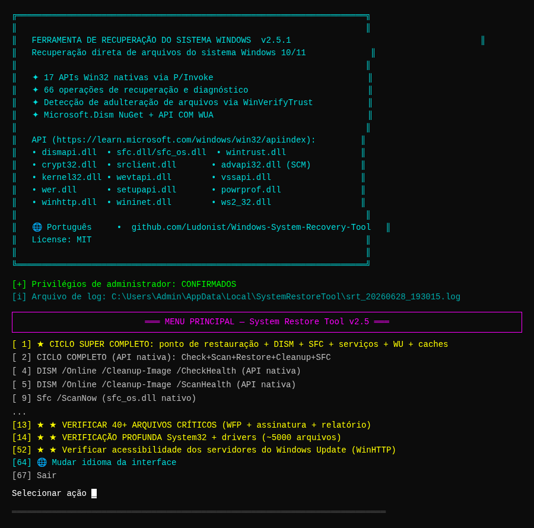
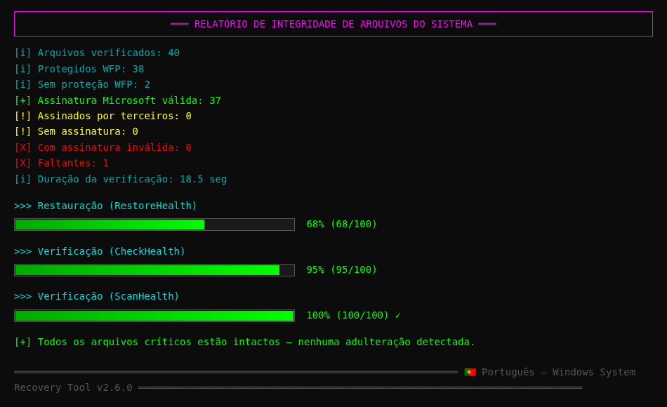
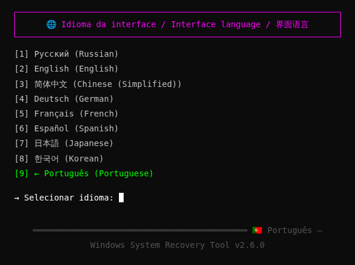
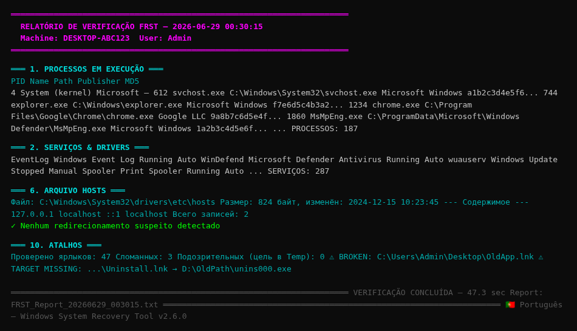
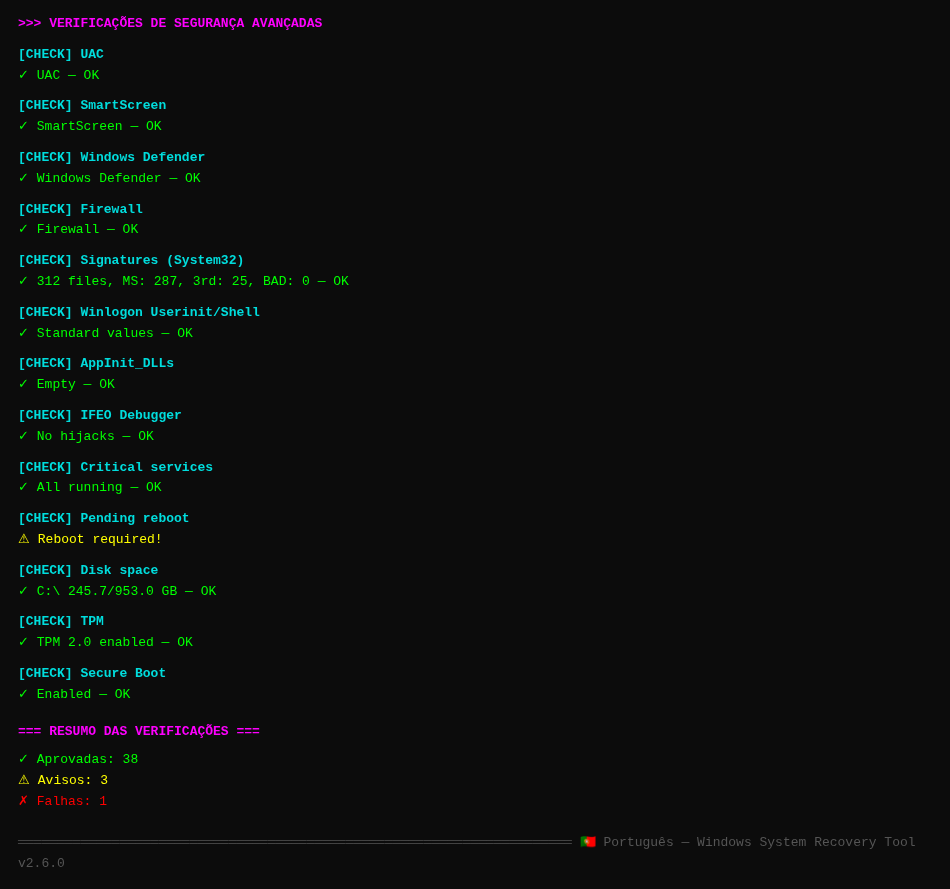
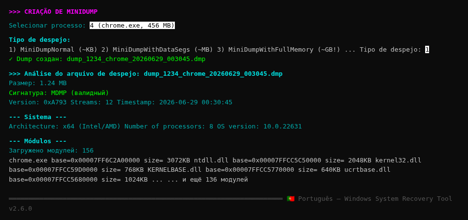

# 🔧 Ferramenta de Recuperação do Sistema Windows

<div align="center">

🌐 **Idiomas disponíveis / Available languages / 可用语言 / Unterstützte Sprachen / Langues disponibles / Idiomas disponibles / 利用可能な言語 / 사용 가능한 언어 / Idiomas disponíveis:**

[🇷🇺 Русский](README.md) · [🇬🇧 English](README.en.md) · [🇨🇳 简体中文](README.zh.md) · [🇩🇪 Deutsch](README.de.md) · [🇫🇷 Français](README.fr.md) · [🇪🇸 Español](README.es.md) · [🇯🇵 日本語](README.ja.md) · [🇰🇷 한국어](README.ko.md) · [🇵🇹 Português](README.pt.md)

🌐 **Documentação com detecção automática de idioma**: https://ludonist.github.io/Windows-System-Recovery-Tool/

---


**Ferramenta profissional para recuperação de arquivos do sistema Windows 10/11 através de chamadas diretas à API Win32**

🌐 **Interface multilíngue**: Русский · English · 简体中文 · Deutsch · Français · Español · 日本語 · 한국어 · Português

[Funcionalidades](#-features) ·
[Capturas de tela](#-screenshots) ·
[Instalação](#-installation) ·
[Uso](#-usage) ·
[Arquitetura](#-architecture) ·
[API](#-win32-apis-used) ·
[Compilação](#-building-from-source) ·
[Contribuir](#-contributing)

</div>

---

## 📖 Sobre

**Ferramenta de Recuperação do Sistema Windows** é um aplicativo de console para Windows 10/11 que recupera e verifica a integridade dos arquivos do sistema através de **chamadas diretas à API do Windows** (`dismapi.dll`, `sfc.dll`, `wintrust.dll`, etc.) — e não através de comandos externos `cmd.exe` / `dism.exe` / `sfc.exe`.

### Principais funcionalidades

- 🎯 **67 operações** de recuperação e diagnóstico em um único menu
- 🔌 **17 APIs nativas do Windows** via P/Invoke (sem comandos de shell)
- 🛡️ **Detecção de adulteração de arquivos**: WinVerifyTrust + editor do certificado
- 📊 **Snapshots SHA256/SHA1** para comparar o estado do sistema ao longo do tempo
- 🧩 **Microsoft.Dism NuGet** como alternativa gerenciada
- 📋 **Registro detalhado** em `%LOCALAPPDATA%\SystemRestoreTool\`
- ⚡ **Build autossuficiente** — não requer instalação do .NET
- 🌐 **Interface multilíngue**: Русский / English / 简体中文 / Deutsch / Français / Español / 日本語 / 한국어 / Português

### Problemas que esta ferramenta resolve

| Sintoma | Solução |
|---------|----------|
| `sfc /scannow` encontra corrupção | DISM RestoreHealth + SFC /ScanNow |
| Suspeita de adulteração viral de DLL | WinVerifyTrust em todos os arquivos críticos |
| Windows Update quebrado | Resetar SoftwareDistribution + registrar DLLs novamente |
| Serviços não iniciam | Reiniciar 40+ serviços críticos via SCM |
| Falha do gerenciador de boot | Verificação e recuperação BCD |
| Sem ponto de restauração | Criar via `SRSetRestorePoint` |
| Cache de ícones/fontes corrompido | Reconstruir IconCache.db / FNTCACHE.DAT |
| Preocupações com integridade do sistema | Snapshot SHA256 + comparação com a linha de base |

---

## ✨ Funcionalidades

### 1. Recuperação via API DISM (`dismapi.dll`)

| Operação | Equivalente no console |
|----------|---------------------|
| CheckHealth | `Dism /Online /Cleanup-Image /CheckHealth` |
| ScanHealth | `Dism /Online /Cleanup-Image /ScanHealth` |
| RestoreHealth | `Dism /Online /Cleanup-Image /RestoreHealth` |
| StartComponentCleanup | `Dism /Online /Cleanup-Image /StartComponentCleanup` |
| StartComponentCleanup + ResetBase | `... /StartComponentCleanup /ResetBase` |

### 2. SFC via `sfc_os.dll` nativo

| Operação | Equivalente |
|----------|------------|
| SfcSynchronousScan (ScanAndRepair) | `Sfc /ScanNow` |
| SfcSynchronousScan (VerifyOnly) | `Sfc /VerifyOnly` |
| SfcIsFileProtected | (sem equivalente) |
| SfcGetNextProtectedFile | (sem equivalente) |

### 3. Verificação de integridade

- **40+ arquivos críticos** — kernel32.dll, ntdll.dll, winlogon.exe, lsass.exe, csrss.exe, smss.exe, drivers (tcpip.sys, ntfs.sys, volmgr.sys, ACPI.sys, hal.dll, ...) e mais
- **Verificação profunda System32 + drivers** — todos os .dll/.exe/.sys (~5000 arquivos)
- **Verificação completa System32 + SysWOW64** — ~10000 arquivos
- Para cada arquivo: proteção WFP, assinatura Authenticode, editor (Microsoft vs terceiros)

### 4. Módulos de recuperação (14 módulos)

| Módulo | Finalidade | API |
|--------|---------|-----|
| `SystemRestorePointManager` | Pontos de restauração | `srclient.dll!SRSetRestorePoint` |
| `ServicesRepairManager` | Reiniciar 40+ serviços | `advapi32.dll` SCM |
| `BootRecoveryManager` | BCD, bootmgr, winload | WMI + bcdedit |
| `RegistryRestoreManager` | Backup de hives do Registro | `advapi32.dll!RegSaveKey` |
| `WindowsUpdateRepairManager` | Resetar WU | SCM + File API |
| `WinSxsRepairManager` | Limpeza do WinSxS | `dismapi.dll!DismAnalyzeComponentStore` |
| `EventLogManager` | Logs de eventos | `wevtapi.dll!EvtClearLog` |
| `UserEnvRestoreManager` | Perfis, caches | advapi32 + File API |
| `FileHashDatabaseManager` | Snapshots SHA256 | `System.Security.Cryptography` |
| `DeviceManager` | Dispositivos | `setupapi.dll` |
| `PowerOptionsManager` | Esquemas de energia | `powrprof.dll` |
| `NetworkDiagnosticManager` | Rede | `winhttp.dll` + `ws2_32.dll` |
| `WerManager` | Relatórios WER | `wer.dll` |
| `WindowsUpdateAgentManager` | Busca de atualizações | COM WUA API |

---

## 📸 Capturas de tela

### Menu Principal



### Verificação de integridade de arquivos do sistema (com barras de progresso)



### Mudar idioma da interface



### Verificação completa do sistema FRST



### Verificações de segurança avançadas (40+)



### Gerenciador MiniDump — análise de processos



---

## 📥 Instalação

### Opção 1: Baixar EXE pré-compilado (recomendado)

**Links de download direto** (build recente, sem dependências):

| Arquitetura | Autossuficiente (inclui .NET) | Compacto (requer .NET 6) |
|--------------|----------------------------:|--------------------------:|
| **x64** (Intel/AMD) | [standalone-win-x64.zip](https://github.com/Ludonist/Windows-System-Recovery-Tool/releases/download/v2.5.1/SystemRestoreTool-standalone-win-x64.zip) (~40 MB) | [compact-win-x64.zip](https://github.com/Ludonist/Windows-System-Recovery-Tool/releases/download/v2.5.1/SystemRestoreTool-standalone-win-x64-compact.zip) (~7 MB) |
| **x86** (32-bit) | [standalone-win-x86.zip](https://github.com/Ludonist/Windows-System-Recovery-Tool/releases/download/v2.5.1/SystemRestoreTool-standalone-win-x86.zip) (~37 MB) | [compact-win-x86.zip](https://github.com/Ludonist/Windows-System-Recovery-Tool/releases/download/v2.5.1/SystemRestoreTool-standalone-win-x86-compact.zip) (~7 MB) |
| **ARM64** (Surface/Qualcomm) | [standalone-win-arm64.zip](https://github.com/Ludonist/Windows-System-Recovery-Tool/releases/download/v2.5.1/SystemRestoreTool-standalone-win-arm64.zip) (~33 MB) | [compact-win-arm64.zip](https://github.com/Ludonist/Windows-System-Recovery-Tool/releases/download/v2.5.1/SystemRestoreTool-standalone-win-arm64-compact.zip) (~6 MB) |

**Versão autossuficiente** (recomendada) — inclui o .NET 6 Runtime, não requer nada mais.

**Versão compacta** — requer [.NET Desktop Runtime 6.0+](https://dotnet.microsoft.com/download/dotnet/6.0).

### Opção 2: GitHub Releases

Todos os binários também estão disponíveis na página [Releases v2.5.1](https://github.com/Ludonist/Windows-System-Recovery-Tool/releases/tag/v2.5.1), junto com checksums SHA256 para verificação de integridade.

### Opção 3: Compilar a partir do código-fonte

Veja [Compilar a partir do código-fonte](#-building-from-source).

### Requisitos

- **SO**: Windows 10 (build 19041+, May 2020 Update) ou Windows 11
- **Arquitetura**: x64 / x86 / ARM64
- **Privilégios**: Administrador (o manifesto já especifica isso)
- **Para build compacto**: .NET Desktop Runtime 6.0+

### Verificar integridade

Após o download, verifique o SHA256:
```cmd
certutil -hashfile SystemRestoreTool-standalone-win-x64.zip SHA256
```
Compare com os arquivos `.sha256` ao lado de cada arquivo na página [Releases v2.5.1](https://github.com/Ludonist/Windows-System-Recovery-Tool/releases/tag/v2.5.1).

---

## 🚀 Uso

### Modo interativo

Execute `SystemRestoreTool.exe` como administrador. Um menu de 67 itens será aberto:

```
╔══════════════════════════════════════════════════════════════════════╗
║                                                                      ║
║   WINDOWS SYSTEM RECOVERY TOOL  v2.5.1                               ║
║   Direct recovery of Windows 10/11 system files                      ║
║   ...                                                                ║
╚══════════════════════════════════════════════════════════════════════╝
[+] Administrator privileges: CONFIRMED
[i] Log file: C:\Users\...\AppData\Local\SystemRestoreTool\srt_20260628_193015.log

MAIN MENU — System Restore Tool v2.5

  [ 1] ★ SUPER-FULL CYCLE: restore point + DISM + SFC + services + WU + caches
  [ 2]   FULL CYCLE (native API)
  [ 3]   FULL CYCLE (Microsoft.Dism NuGet)
  ...
  [67]   Exit

Select action: _
```

### Modos automáticos (para scripts)

```cmd
:: Super-full cycle: restore point + DISM + SFC + services + WU + caches
SystemRestoreTool.exe --super-full

:: Same + ResetBase WinSxS
SystemRestoreTool.exe --super-full --reset-base

:: Full DISM + SFC cycle
SystemRestoreTool.exe --full

:: Check 40+ critical files
SystemRestoreTool.exe --verify

:: Deep check System32 + drivers
SystemRestoreTool.exe --scan-all
```

### Registro

Todas as operações são escritas simultaneamente no console (com cores) e em um arquivo:
```
%LOCALAPPDATA%\SystemRestoreTool\srt_YYYYMMDD_HHMMSS.log
```

### 🌐 Interface multilíngue

O programa suporta **3 idiomas de interface**:

| Código | Nome nativo | Nome em inglês |
|------|-------------|--------------|
| `ru` | Русский | Russian |
| `en` | English | English |
| `zh` | 简体中文 | Chinese (Simplified) |

**Para trocar de idioma:**
1. No menu principal, selecione o item **64** ("🌐 Switch interface language")
2. Escolha o idioma desejado (1-3)
3. A escolha é **salva no Registro** (`HKCU\SOFTWARE\SystemRestoreTool\Language`) e aplicada na próxima inicialização

Arquivos de tradução: `Resources/strings.{ru,en,zh}.json`. Eles são incorporados ao EXE como recursos incorporados, então nada mais precisa ser copiado.

**Para adicionar um novo idioma:**
1. Copie `Resources/strings.en.json` para `Resources/strings.xx.json` (`xx` = código do idioma)
2. Traduza todos os valores
3. Adicione o código a `Localizer.SupportedLanguages` e `LanguageNames`
4. Adicione uma entrada em `.csproj` como `<EmbeddedResource>`

---

## 🏗 Arquitetura

```
Windows-System-Recovery-Tool/
├── SystemRestoreTool.csproj      .NET 6.0, x64/x86/ARM64, Microsoft.Dism NuGet
├── app.manifest                  requireAdministrator
├── Program.cs                    Ponto de entrada, menu de 67 itens
│
├── Api/                          Camada P/Invoke (DLLs nativas do Windows)
│   ├── DismNativeApi.cs          dismapi.dll (API DISM)
│   ├── SfcNativeApi.cs           sfc.dll + sfc_os.dll + srclient.dll
│   ├── WinTrustNativeApi.cs      wintrust.dll + crypt32.dll (assinaturas)
│   ├── Kernel32NativeApi.cs      kernel32.dll + advapi32.dll
│   ├── SrclientNativeApi.cs      srclient.dll (pontos de restauração)
│   ├── ServicesNativeApi.cs      advapi32.dll (Service Control Manager)
│   ├── EventLogNativeApi.cs      advapi32.dll + wevtapi.dll
│   ├── VssNativeApi.cs           vssapi.dll (Volume Shadow Copy)
│   ├── WerNativeApi.cs           wer.dll (Windows Error Reporting)
│   ├── SetupApiNativeApi.cs      setupapi.dll (dispositivos)
│   ├── PowerNativeApi.cs         powrprof.dll (energia)
│   └── NetNativeApi.cs           winhttp.dll + wininet.dll + ws2_32.dll
│
├── Engine/                       Lógica de alto nível
│   ├── SystemRestoreEngine.cs    Orquestração do ciclo de recuperação
│   ├── DismManagedWrapper.cs     Via Microsoft.Dism NuGet
│   ├── SignatureVerifier.cs      Verificação de assinatura de alto nível
│   ├── IntegrityChecker.cs       Verifica 40+ arquivos críticos + todo System32
│   └── Modules/                  Módulos especializados (14)
│       ├── SystemRestorePointManager.cs
│       ├── ServicesRepairManager.cs
│       ├── BootRecoveryManager.cs
│       ├── RegistryRestoreManager.cs
│       ├── WindowsUpdateRepairManager.cs
│       ├── WinSxsRepairManager.cs
│       ├── EventLogManager.cs
│       ├── UserEnvRestoreManager.cs
│       ├── FileHashDatabaseManager.cs
│       ├── DeviceManager.cs
│       ├── PowerOptionsManager.cs
│       ├── NetworkDiagnosticManager.cs
│       ├── WerManager.cs
│       └── WindowsUpdateAgentManager.cs
│
├── Resources/                    🌐 Localização (recursos incorporados)
│   ├── strings.ru.json           Русский (padrão)
│   ├── strings.en.json           English
│   └── strings.zh.json           简体中文
│
├── Utils/
│   ├── ConsoleHelper.cs          Auxiliar de UI (menu, privilégios, entrada)
│   ├── Logger.cs                 Logger de arquivo + console colorido
│   └── Localizer.cs              Carregamento e troca de idioma
│
├── docs/
│   ├── api-reference.md          Referência detalhada da API Win32
│   └── screenshots/              Capturas de tela do programa (PNG)
│
├── .github/
│   ├── repo-metadata.json        Topics e descrição do repositório
│   └── workflows/
│       └── build-release.yml     CI: build x86/x64/ARM64 + Release
│
├── .gitignore                    .gitignore .NET padrão
├── .editorconfig                 Estilo de código
├── LICENSE                       MIT
├── CHANGELOG.md                  Histórico de alterações
├── CONTRIBUTING.md               Regras para contribuidores
├── SECURITY.md                   Política de segurança
├── README.md                     Documentação russa (padrão)
├── README.en.md                  Documentação inglesa
└── README.zh.md                  Documentação chinesa
```

### Estatísticas do código

- **~7200 linhas de código C#**
- **37 arquivos** em 6 diretórios
- **17 DLLs nativas** via P/Invoke
- **14 módulos de recuperação**
- **67 itens de menu**
- **3 idiomas de interface** (RU/EN/ZH)

---

## 🔌 APIs Win32 usadas

Todas as operações usam **chamadas P/Invoke diretas** (sem comandos de shell):

| DLL | Finalidade |
|-----|-----------|
| `dismapi.dll` | DISM: CheckHealth / ScanHealth / RestoreHealth / StartComponentCleanup |
| `sfc.dll` | SfcIsFileProtected / SfcGetNextProtectedFile |
| `sfc_os.dll` | SfcSynchronousScan (= Sfc /ScanNow) |
| `wintrust.dll` | WinVerifyTrust (assinaturas Authenticode) |
| `crypt32.dll` | CryptQueryObject / CertGetNameString (editor) |
| `srclient.dll` | SRSetRestorePoint (pontos de restauração) |
| `advapi32.dll` | SCM (serviços), registro, privilégios |
| `kernel32.dll` | Arquivos, reinicialização, App Recovery/Restart |
| `wevtapi.dll` | Logs de eventos (EvtClearLog) |
| `vssapi.dll` | Volume Shadow Copy |
| `wer.dll` | Windows Error Reporting |
| `setupapi.dll` | Instalador de dispositivos |
| `cfgmgr32.dll` | CM_Reenumerate_DevNode |
| `powrprof.dll` | Esquemas de energia, bateria |
| `winhttp.dll` | Verificações de servidor HTTP |
| `wininet.dll` | InternetGetConnectedState |
| `ws2_32.dll` | Winsock (WSAStartup) |
| **Microsoft.Dism NuGet** | Wrapper gerenciado da API DISM |
| **COM WUA API** | Windows Update Agent (`Microsoft.Update.Session`) |

Detalhes em [docs/api-reference.md](docs/api-reference.md).

---

## 🛠 Compilar a partir do código-fonte

### Requisitos

- **Windows 10** (build 19041+) ou **Windows 11**
- **.NET 6.0 SDK** ou mais recente — https://dotnet.microsoft.com/download
- (Opcional) Visual Studio 2022 / JetBrains Rider / VS Code

### Passos

```bash
git clone https://github.com/Ludonist/Windows-System-Recovery-Tool.git
cd Windows-System-Recovery-Tool
dotnet restore
dotnet build -c Release
```

Resultado: `bin\Release\net6.0-windows10.0.19041.0\win-x64\SystemRestoreTool.exe`

### Publicação de arquivo único

```bash
# Compacto (requer .NET 6 na máquina de destino, ~27 MB)
dotnet publish -c Release -r win-x64 --self-contained false -p:PublishSingleFile=true

# Autossuficiente (sem dependências, ~45 MB)
dotnet publish -c Release -r win-x64 --self-contained true \
  -p:PublishSingleFile=true \
  -p:IncludeNativeLibrariesForSelfExtract=true \
  -p:EnableCompressionInSingleFile=true
```

### Arquiteturas suportadas

```bash
# x64 (Intel/AMD 64-bit) — principal
dotnet publish -c Release -r win-x64 ...

# x86 (32-bit) — para sistemas mais antigos
dotnet publish -c Release -r win-x86 ...

# ARM64 (Surface Pro X, notebooks Snapdragon)
dotnet publish -c Release -r win-arm64 -p:PublishReadyToRun=false ...
```

---

## 📋 Lista de arquivos verificados

### 40+ arquivos críticos (`IntegrityChecker.CriticalFiles`)

- **DLLs base**: kernel32.dll, ntdll.dll, user32.dll, advapi32.dll, shell32.dll, ole32.dll, gdi32.dll, msvcrt.dll, ws2_32.dll, wininet.dll, urlmon.dll, combase.dll, sechost.dll, rpcrt4.dll, setupapi.dll
- **Carregadores e processos**: winload.exe, winresume.exe, winlogon.exe, csrss.exe, services.exe, lsass.exe, lsaiso.exe, smss.exe, svchost.exe, spoolsv.exe, wininit.exe, dwm.exe
- **Criptografia**: bcrypt.dll, ncrypt.dll, schannel.dll, crypt32.dll, cryptbase.dll, cryptsp.dll, wintrust.dll, msasn1.dll
- **DISM/SFC**: sfc.dll, sfc_os.dll, dismapi.dll, dism.exe, sfc.exe
- **Gerenciamento**: mmc.exe, powershell.exe, cmd.exe, regedit.exe, taskmgr.exe, eventvwr.exe
- **Shell**: explorer.exe, shdocvw.dll, shellstyle.dll, themecpl.dll, themeui.dll
- **Drivers de kernel**: tcpip.sys, ntfs.sys, volmgr.sys, volmgrx.sys, disk.sys, partmgr.sys, ACPI.sys, hal.dll, ndis.sys, http.sys, Wdf01000.sys, ksecdd.sys, ksecpkg.sys, msisadrv.sys, pci.sys, mountmgr.sys, fltMgr.sys, luafv.sys, mrxsmb.sys, mup.sys
- **.NET Framework**: clr.dll, mscorlib.dll, System.dll
- **WinRT**: Windows.Foundation.winmd, WinRTTraceLogger.dll
- **WSL**: lxss.dll, wslapi.dll

### Verificação profunda (System32 + drivers)

- Todos os `.dll`, `.exe`, `.sys`, `.cpl` em `C:\Windows\System32`
- Todos os `.sys` em `C:\Windows\System32\drivers`
- Drivers UMDF: `C:\Windows\System32\drivers\UMDF`
- Drivers do Windows Defender: `C:\Windows\System32\drivers\wd`
- Todos os `.exe`, `.dll` em `C:\Windows`

### Verificação completa

Adicionalmente: `C:\Windows\SysWOW64` (versões 32 bits das bibliotecas do sistema)

---

## 📊 Relatório de exemplo

```
[i] Files checked:                40
[i] WFP-protected:                38
[i] Without WFP protection:       2
[+] Valid Microsoft signature:    37
[!] Signed by third party:        0
[!] Without signature:            0
[X] With bad signature:           0
[X] Missing:                      1
[i] Check duration:               18.5 sec

All critical files are intact — no tampering detected.
```

---

## 🔒 Segurança

- ✅ O programa **não inicia** `cmd.exe`, `dism.exe`, `sfc.exe`, `powershell.exe` (exceto `bcdedit.exe` e `netsh.exe` para operações sem equivalentes P/Invoke)
- ✅ Todas as operações usam APIs Win32 nativas
- ✅ Privilégios de administrador necessários (manifesto `requireAdministrator`)
- ✅ Os logs são escritos **localmente** em `%LOCALAPPDATA%\SystemRestoreTool\`
- ✅ Nenhum dado é enviado pela rede
- ✅ Código aberto sob licença MIT — você pode auditar o código

## ⚠️ Limitações

1. **Apenas Windows 10/11** — para Windows 7/8 você precisaria alterar o `TargetFramework`
2. **RestoreHealth** pode exigir acesso ao Windows Update ou à mídia de instalação
3. **SfcSynchronousScan** não é documentado — em alguns builds pode precisar de flags adicionais
4. **ResetBase** é irreversível — depois disso, você não pode desinstalar as atualizações instaladas
5. **bcdedit / bootrec** não têm equivalentes P/Invoke — chamados diretamente via `Process.Start` (sem cmd.exe)
6. **RegSaveKey** para hives ativos pode falhar (arquivos bloqueados pelo sistema) — nesse caso, é usada a cópia direta de arquivos

---

## 📈 Roteiro

- [ ] Versão GUI (WPF) com gráficos
- [ ] Localização da interface (Deutsch / Français / Español / 日本語)
- [ ] Detecção automática de pacotes «quebrados» via CBS.log
- [ ] Suporte ao Windows Server 2022/2025 como perfis separados
- [ ] Agendador de tarefas (p. ex., verificação semanal de integridade)
- [ ] Exportar relatórios para HTML/PDF

Veja as [issues abertas](https://github.com/Ludonist/Windows-System-Recovery-Tool/issues) para a lista completa.

---

## 🤝 Contribuir

Pull requests são bem-vindos! Veja [CONTRIBUTING.md](CONTRIBUTING.md) para as regras.

Especialmente necessário:
- 🌍 Tradução da interface para outros idiomas
- 🐛 Relatórios de bugs com logs de falhas reais
- 📚 Documentação de casos extremos em diferentes builds do Windows
- 🧪 Testes em dispositivos ARM64 (Surface Pro X, etc.)

---

## 📄 Licença

Licença MIT — veja [LICENSE](LICENSE).

Você é livre para usar, modificar e distribuir este código.

---

## 🙏 Agradecimentos

- [Microsoft.Dism NuGet](https://github.com/jeffkl/ManagedDism) — wrapper gerenciado da API DISM por Jeff Kluge
- [Microsoft Learn Win32 API List](https://learn.microsoft.com/windows/win32/apiindex/windows-api-list) — documentação da API do Windows
- [pinvoke.net](https://www.pinvoke.net/) — referência de assinaturas P/Invoke

---

## ⭐ Histórico de estrelas

Se você achou este programa útil — dê uma ⭐ ao repositório!

<div align="center">

**[⬆ Voltar ao topo](#-ferramenta-de-recuperação-do-sistema-windows)**

Feito com ❤️ para usuários avançados de Windows

</div>
